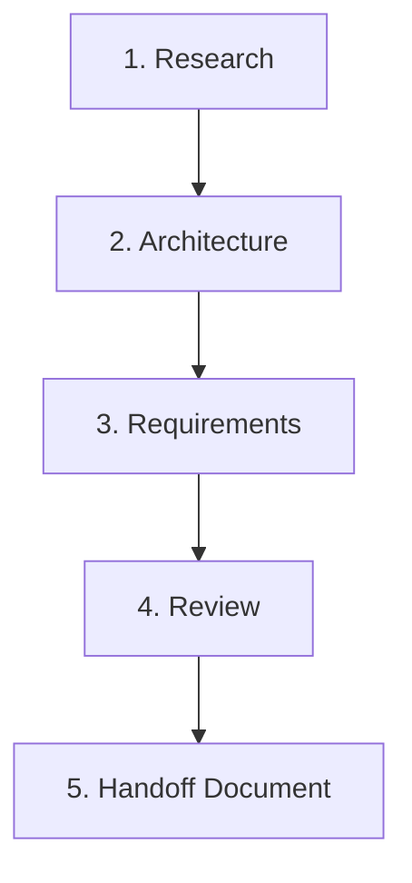

# Brainstorm

Systematically research, architect, and document feature ideas without writing code. Creates comprehensive specifications that can be handed to implementation teams.

## Usage

```bash
/brainstorm [idea or problem description]
```

**Examples:**
```bash
/brainstorm "Add real-time notifications to the app"
/brainstorm "Improve performance of search functionality"
/brainstorm "User authentication with social login"
/brainstorm "Implement file upload system with virus scanning"
```

## Workflow Overview

The brainstorming workflow consists of 5 key phases:



## Phase 1: Research

**Objective**: Gather comprehensive information about the idea.

### Actions

**You MUST launch the idea-researcher agent to conduct thorough research.**

Use the Task tool to launch the agent with a comprehensive prompt:

```
Use the Task tool with subagent_type: "brainstorm:idea-researcher"

Prompt the agent to:
1. Research existing solutions for [user's idea]
2. Find best practices and case studies
3. Analyze technology options (search for "[technology] best practices 2025")
4. Study current codebase patterns (use Glob and Grep to find similar features)
5. Identify integration points and constraints
6. Document challenges and opportunities

The agent should produce a comprehensive research report covering:
- Problem analysis with target users
- Existing solutions (commercial and open-source)
- Technology landscape and recommendations
- Codebase analysis (current patterns, integration points)
- Potential challenges with mitigations
- Opportunities for improvement
```

**Wait for the agent to complete** before proceeding to Phase 2.

### Research Report Contents

```markdown
# Research Report: [Feature Name]

## Executive Summary
- Problem statement
- Proposed solution concept
- Key findings

## Problem Analysis
- Detailed problem description
- Target users and their needs
- Success criteria
- Constraints

## Existing Solutions Research
- Commercial solutions analyzed
- Open source options evaluated
- Best practices identified
- Industry trends

## Technology Landscape
- Recommended technologies with rationale
- Technology comparison table
- Integration considerations

## Codebase Analysis
- Current architecture patterns
- Existing related code
- Integration points
- Code patterns to follow

## Potential Challenges
- Technical challenges with mitigations
- Implementation risks
- Team skill gaps

## Opportunities
- Quick wins identified
- Strategic improvements
- Competitive advantages

## Key Insights
- Major findings from research
- Implications for implementation
```

## Phase 2: Architecture

**Objective**: Design comprehensive solution architecture.

### Actions

**You MUST launch the solution-architect agent to design the solution architecture.**

Use the Task tool to launch the agent with a comprehensive prompt:

```
Use the Task tool with subagent_type: "brainstorm:solution-architect"

Prompt the agent to:
1. Analyze the research findings from Phase 1
2. Evaluate multiple solution approaches (at least 2-3 alternatives)
3. Design high-level system architecture
4. Create component architecture diagrams
5. Design data architecture and database schema
6. Plan security architecture
7. Create implementation roadmap with phases
8. Document architecture decisions (ADRs) with rationale
9. Assess risks and mitigations
10. Estimate timeline for each phase

The agent should produce a comprehensive architecture document covering:
- Executive summary with problem, solution, timeline, risk level
- Approach evaluation (recommended + alternatives with trade-offs)
- System architecture (high-level, component, data, security, network)
- Technical specifications (API, component, database specs)
- Implementation roadmap (phases with timeline)
- Architecture Decision Records (ADRs)
- Dependencies (external, internal, team)
- Risk assessment with mitigations
- Success criteria (functional and non-functional requirements)

Present multiple approaches to the user with trade-offs and get approval for the chosen approach.
```

**Wait for the agent to complete and get user approval** of the chosen approach before proceeding to Phase 3.

### Architecture Document Contents

```markdown
# Solution Architecture: [Feature Name]

## Executive Summary
- Problem being solved
- High-level solution
- Timeline estimate
- Risk level

## Approach Evaluation
- Recommended approach (detailed)
- Alternative approaches considered
- Trade-offs and rationale

## System Architecture
- High-level architecture diagram
- Component architecture
- Data architecture
- Security architecture
- Network architecture

## Technical Specifications
- API specifications
- Component specifications
- Database specifications

## Implementation Roadmap
- Phase 1: Foundation
- Phase 2: Core Features
- Phase 3: Integration
- Phase 4: Polish & Deploy

## Architecture Decisions (ADRs)
- ADR-001: [Major decision]
- ADR-002: [Another decision]
- ...

## Dependencies
- External dependencies
- Internal dependencies
- Team dependencies

## Risk Assessment
- Technical risks with mitigations
- Implementation risks with plans

## Success Criteria
- Functional requirements
- Non-functional requirements
```

## Phase 3: Requirements

**Objective**: Create implementation-ready requirements.

### Actions

**You MUST launch the requirements-writer agent to create detailed implementation requirements.**

Use the Task tool to launch the agent with a comprehensive prompt:

```
Use the Task tool with subagent_type: "brainstorm:requirements-writer"

Prompt the agent to:
1. Synthesize research findings and approved architecture from Phases 1-2
2. Write user stories with detailed acceptance criteria and story points
3. Document all functional requirements (FR-001, FR-002, etc.)
4. Create complete API specifications (endpoints, request/response schemas, validation, errors)
5. Design database schema with SQL table definitions, indexes, constraints, migration scripts
6. Specify all UI components (props, state management, behavior, styling)
7. Define service layer (business logic, method signatures, error handling)
8. Document non-functional requirements (performance, scalability, security, availability)
9. Identify and document all edge cases with expected behavior
10. Create comprehensive test scenarios (unit, integration, E2E)
11. Generate implementation checklist (backend, frontend, DevOps tasks)
12. Define "Definition of Done" with acceptance criteria, testing, documentation requirements

The agent should produce implementation-ready requirements document with:
- Overview (feature description, priority, timeline, dependencies)
- User stories (epic and detailed stories with acceptance criteria and points)
- Functional requirements (each with inputs, process, outputs)
- Technical specifications (API, database schema, components, services)
- Non-functional requirements (performance targets, security, availability)
- Edge cases and error handling (all scenarios documented)
- Test scenarios (comprehensive test cases)
- Implementation checklist (all tasks across teams)
- Definition of done (complete acceptance checklist)

Save outputs to ./docs/brainstorm/[feature-name]/ directory structure.
```

**Wait for the agent to complete** before proceeding to Phase 4.

### Requirements Document Contents

```markdown
# Implementation Requirements: [Feature Name]

## Overview
- Feature description
- Priority level
- Timeline estimate
- Dependencies

## User Stories
- Epic level stories
- Detailed stories with acceptance criteria
- Story points and priorities

## Functional Requirements
- FR-001: [Requirement with inputs, process, outputs]
- FR-002: [Another requirement]
- ...

## Technical Specifications

### API Specifications
- Endpoint details
- Request/response schemas
- Validation rules
- Error responses
- Rate limiting

### Database Schema
- Table definitions with SQL
- Indexes and constraints
- Migration scripts

### Component Specifications
- UI components with props
- State management
- Behavior descriptions
- Styling requirements

### Service Layer
- Business logic services
- Method signatures
- Error handling
- Dependencies

## Non-Functional Requirements
- Performance targets
- Scalability requirements
- Security requirements
- Availability targets
- Usability standards

## Edge Cases & Error Handling
- All edge cases documented
- Expected behavior defined
- Error scenarios covered

## Test Scenarios
- Unit test cases
- Integration test cases
- E2E test scenarios

## Implementation Checklist
- Backend tasks
- Frontend tasks
- DevOps tasks

## Definition of Done
- Acceptance criteria checklist
- Testing requirements
- Documentation requirements
- Approval gates
```

## Phase 4: Review

**Objective**: Review and refine the specifications.

### Actions
1. **Present complete package** to user:
   - Research findings
   - Architecture design
   - Implementation requirements

2. **Gather feedback**:
   - What needs clarification?
   - What's missing?
   - What should be adjusted?

3. **Refine as needed**:
   - Update specifications
   - Add missing details
   - Adjust approach if needed

4. **Get final approval**

## Phase 5: Handoff Document

**Objective**: Create final implementation package.

### Actions
1. **Consolidate all outputs** into single handoff document

2. **Create executive summary**:
   - What we're building
   - Why we're building it
   - How we'll build it
   - When it will be done

3. **Package for handoff**:
   - Research report
   - Architecture document
   - Requirements document
   - Implementation checklist

4. **Save to documentation**:
   - Write to `./docs/brainstorm/[feature-name]/`
   - Include all diagrams and specs
   - Create README with overview

### Final Package Structure

```
./docs/brainstorm/[feature-name]/
├── README.md                    # Executive summary
├── 01-research-report.md        # Full research findings
├── 02-architecture.md           # System architecture
├── 03-requirements.md           # Implementation requirements
├── 04-api-specs.md             # API specifications
├── 05-database-schema.md       # Database design
├── 06-test-scenarios.md        # Test cases
└── diagrams/
    ├── architecture.png         # Architecture diagram
    ├── data-flow.png           # Data flow diagram
    └── component-diagram.png   # Component diagram
```

## Core Principles

### 1. Research First
- Understand the problem deeply
- Learn from existing solutions
- Identify best practices
- Know the constraints

### 2. Design Before Implementing
- Evaluate multiple approaches
- Consider trade-offs
- Document decisions
- Plan phases

### 3. Specify Comprehensively
- Write detailed requirements
- Define acceptance criteria
- Document edge cases
- Create test scenarios

### 4. No Code Changes
- This is a planning tool
- Outputs are specifications only
- Implementation happens separately
- Specifications guide developers

### 5. Collaborative
- Get user feedback frequently
- Present options with trade-offs
- Explain reasoning
- Allow course corrections

## Best Practices

### Problem Definition
```markdown
## Clear Problem Statement
**Problem**: Users can't see updates in real-time, must refresh page
**Impact**: Poor UX, missed important updates, user frustration
**Goal**: Enable real-time updates without manual refresh
**Success**: Updates appear within 2 seconds, no refresh needed
```

### Research Depth
- Search multiple sources
- Check recent articles (2024-2025)
- Look for case studies
- Analyze production implementations
- Consider team capabilities

### Architecture Quality
- Show diagrams (ASCII art or Mermaid)
- Explain trade-offs clearly
- Document why decisions were made
- Consider future evolution
- Plan for failure scenarios

### Requirements Completeness
- Every user story has acceptance criteria
- Every API has request/response examples
- Every table has migration script
- Every requirement has test scenario
- Every edge case has expected behavior

## When to Use This Command

**Use /brainstorm when:**
- Exploring a new feature idea
- Major architectural change needed
- Technology choice decision required
- Understanding problem better
- Creating implementation plan
- Need comprehensive documentation

**Don't use /brainstorm when:**
- Simple bug fix (use /fix-bug)
- Minor code change
- Just want to implement immediately
- Already have detailed specs

## Output Format

The command produces a comprehensive package:

```markdown
# Brainstorm Package: [Feature Name]

## Executive Summary
**What**: [Feature description]
**Why**: [Business value]
**How**: [Approach summary]
**When**: [Timeline estimate]
**Risk**: Low/Medium/High

## Research Findings
[Link to research report]

**Key Insights**:
1. [Insight 1]
2. [Insight 2]
3. [Insight 3]

**Technology Recommendation**: [Technology] because [reasons]

## Architecture Design
[Link to architecture document]

**Approach**: [Chosen approach name]
**Components**: [List main components]
**Timeline**: [Phase breakdown]

**Key Decisions**:
- ADR-001: [Decision summary]
- ADR-002: [Decision summary]

## Implementation Requirements
[Link to requirements document]

**User Stories**: [Count] stories totaling [points] story points
**API Endpoints**: [Count] new endpoints
**Database Changes**: [Count] new tables, [count] migrations
**Test Scenarios**: [Count] unit tests, [count] integration tests

## Next Steps

### Immediate Actions
1. Review and approve specifications
2. Assign to development team
3. Create project tickets

### Implementation Phases
- **Phase 1** (Week 1-2): Foundation
- **Phase 2** (Week 3-5): Core Features
- **Phase 3** (Week 6-7): Integration
- **Phase 4** (Week 8): Polish & Deploy

### Success Metrics
- [ ] All functional requirements met
- [ ] Performance targets achieved
- [ ] Security requirements satisfied
- [ ] User acceptance testing passed

## Files Created
- ✅ Research report: `./docs/brainstorm/[feature]/01-research-report.md`
- ✅ Architecture: `./docs/brainstorm/[feature]/02-architecture.md`
- ✅ Requirements: `./docs/brainstorm/[feature]/03-requirements.md`
- ✅ API specs: `./docs/brainstorm/[feature]/04-api-specs.md`
- ✅ Database schema: `./docs/brainstorm/[feature]/05-database-schema.md`
- ✅ Test scenarios: `./docs/brainstorm/[feature]/06-test-scenarios.md`

**Ready for Implementation**: Yes ✅
```

## Tips for Users

### Provide Good Input
**Good**: "Add real-time notifications for order updates, user mentions, and system alerts. Users should see notifications within 2 seconds. Must work on web and mobile."

**Not Enough**: "Add notifications"

### Ask Questions
- "What technologies should we consider?"
- "How does this fit with our current architecture?"
- "What are the main risks?"
- "What's the simplest approach?"

### Review Thoughtfully
- Read all sections, not just summary
- Check if edge cases are covered
- Verify specs match your expectations
- Ask for clarifications
- Provide feedback

### Use the Output
- Share with development team
- Create project tickets from requirements
- Use architecture as design reference
- Use test scenarios for QA planning
- Update as implementation progresses

This command creates thorough, well-researched specifications that set implementation teams up for success.
