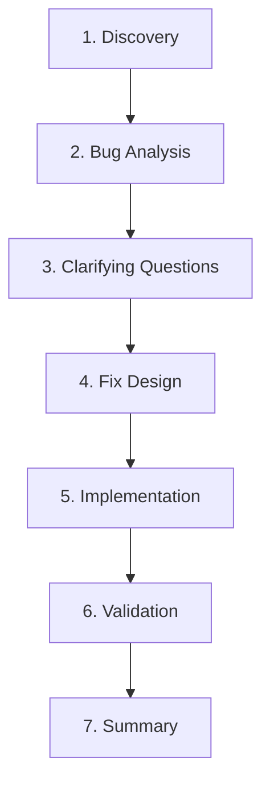

# Fix Bug

Systematically analyze, fix, and validate bugs with a comprehensive workflow that ensures quality and prevents regressions.

## Usage

```bash
/fix-bug [bug description or issue number]
```

**Examples:**
```bash
/fix-bug "TypeError when invalid discount code is used"
/fix-bug #123
/fix-bug "Payment processing crashes on empty cart"
/fix-bug User authentication fails after password reset
```

## Workflow Overview

The bug-fixing workflow consists of 7 key phases:



## Phase 1: Discovery

**Objective**: Understand the bug and create a task plan.

### Actions
1. **Create todo list** for tracking progress
2. **Clarify bug description**:
   - What is the expected behavior?
   - What is the actual behavior?
   - How to reproduce?
   - What error messages appear?
3. **Confirm understanding** with user before proceeding

### Questions to Ask
```markdown
## Bug Clarification

I need some information to analyze this bug effectively:

1. **Expected Behavior**: What should happen?
2. **Actual Behavior**: What actually happens?
3. **Reproduction Steps**: How can I reproduce this?
4. **Error Messages**: What error messages do you see?
5. **Environment**: When does this occur? (all environments, production only, etc.)
6. **Frequency**: Does this happen every time or intermittently?
7. **Recent Changes**: Was there a recent code change before this started?
```

### Todo List Example
```markdown
- [ ] Understand bug description and reproduction steps
- [ ] Analyze codebase to identify root cause
- [ ] Present clarifying questions to user
- [ ] Design fix approach with trade-offs
- [ ] Get user approval for fix approach
- [ ] Implement the fix
- [ ] Write tests for the fix
- [ ] Validate fix with test suite
- [ ] Verify no regressions
- [ ] Document the fix
```

## Phase 2: Bug Analysis

**Objective**: Deep analysis to identify root cause and impact.

### Actions
1. **Launch 1-2 bug-analyzer agents** to:
   - Trace execution paths
   - Identify root cause
   - Map affected components
   - Document error propagation
   - Identify edge cases

2. **Agent will analyze**:
   - Error messages and stack traces
   - Code flow from trigger to error
   - Related components and dependencies
   - Similar issues in codebase

3. **Review findings**:
   - Root cause identification
   - Impact assessment
   - Edge cases to consider
   - Related areas to check

### Expected Output
```markdown
## Bug Analysis Summary

**Root Cause**: Missing null check in payment processing
**Location**: `src/services/payment.ts:245`
**Impact**: Payment processing fails for orders with invalid discount codes
**Affected Users**: Any user applying invalid discount codes
**Severity**: High

**Edge Cases Identified**:
1. Empty discount code
2. Expired discount code
3. Malformed discount data
4. Discount amount exceeds order total
```

## Phase 3: Clarifying Questions

**Objective**: Resolve any uncertainties before designing fix.

### Actions
1. **Identify underspecified aspects**:
   - How should invalid discount codes be handled?
   - Should we fail silently or show error to user?
   - What error message should user see?
   - Should we log these errors?

2. **Present questions to user** in clear format

3. **Wait for answers** before proceeding to fix design

### Example Questions
```markdown
## Clarifying Questions

Before I design the fix, I need to clarify a few things:

### Question 1: Error Handling Approach
When an invalid discount code is used, should we:
- **Option A**: Throw an error and show message to user
- **Option B**: Ignore invalid code and process payment without discount
- **Option C**: Log error but continue with fallback behavior

**Recommendation**: Option A for transparency

### Question 2: Error Message
What message should users see?
- **Technical**: "ValidationError: Invalid discount code 'XYZ123'"
- **User-friendly**: "This discount code is not valid. Please check and try again."

**Recommendation**: User-friendly message

### Question 3: Logging
Should we log these events for monitoring?
- **Yes**: Log as warning for analytics
- **No**: Don't log, too noisy

**Recommendation**: Yes, log as warning
```

## Phase 4: Fix Design

**Objective**: Design comprehensive fix approach with trade-offs.

### Actions
1. **Launch 1-2 fix-implementer agents** to:
   - Analyze codebase patterns
   - Evaluate multiple fix approaches
   - Provide implementation blueprint
   - Document edge case handling

2. **Agent will design**:
   - Specific code changes needed
   - Files to modify
   - Validation to add
   - Error handling approach
   - Test strategy

3. **Present fix approaches** with trade-offs:
   - **Approach A**: Minimal fix (quick, low risk)
   - **Approach B**: Defensive programming (robust, more code)
   - **Approach C**: Refactoring (eliminates root cause, higher risk)

4. **Get user approval** before implementation

### Expected Output
```markdown
## Fix Approach Options

### Recommended: Approach B - Defensive Programming

**What**: Add comprehensive validation and error handling

**Changes**:
1. Add null check for discount object
2. Validate discount structure
3. Add descriptive error messages
4. Handle all edge cases

**Pros**:
- Prevents bug and similar issues
- Robust and maintainable
- Clear error messages

**Cons**:
- More code to write and test
- Slightly more complex

**Implementation Blueprint**:
- Modify: `src/services/payment.ts`
- Modify: `src/services/discount.ts`
- Add tests: `src/services/__tests__/payment.test.ts`
- Update types: `src/types/payment.ts`

**Time Estimate**: ~2 hours
**Risk Level**: Low

---

### Alternative: Approach A - Minimal Fix

**What**: Add single null check where error occurs

**Pros**: Quick, minimal changes
**Cons**: Doesn't address underlying issues

Do you approve Approach B, or would you prefer a different approach?
```

## Phase 5: Implementation

**Objective**: Implement the approved fix.

### Actions
1. **Wait for explicit user approval** of fix approach

2. **Read relevant files** identified in blueprint

3. **Implement the fix**:
   - Follow the implementation blueprint exactly
   - Add validation and error handling
   - Update types if needed
   - Follow codebase conventions

4. **Write tests**:
   - Unit tests for fixed functions
   - Edge case tests
   - Integration tests if needed

5. **Keep user informed** of progress via todo updates

### Implementation Checklist
```markdown
## Implementation Progress

- [x] Read existing code
- [x] Implement validation in payment.ts
- [x] Update getDiscount function
- [x] Add descriptive error messages
- [x] Handle all edge cases
- [x] Write unit tests
- [x] Write edge case tests
- [ ] Run tests and fix failures
```

## Phase 6: Validation

**Objective**: Thoroughly validate the fix.

### Actions
1. **Launch 2-3 test-validator agents** to:
   - Run existing test suite
   - Test bug reproduction
   - Test edge cases
   - Check for regressions
   - Review code quality

2. **Agents will check**:
   - All existing tests still pass
   - Bug no longer reproduces
   - Edge cases handled correctly
   - No new bugs introduced
   - Code follows conventions

3. **Consolidate findings**:
   - Identify high-confidence issues (≥80%)
   - Categorize: blocking vs non-blocking
   - Create actionable issue list

4. **Present findings to user**:
   - Test results summary
   - Issues found
   - Recommendations

5. **Address issues** per user decision

### Expected Output
```markdown
## Validation Results

### Test Suite: ✅ PASSING
- Total tests: 245
- Passing: 245 (100%)
- Failing: 0

### Bug Reproduction: ✅ FIXED
- Original bug no longer occurs
- Correct error message displayed
- Appropriate HTTP status returned

### Edge Cases: ✅ HANDLED
- Null order: Handled correctly
- Empty discount code: Handled correctly
- Negative discount: Handled correctly
- Discount > total: Handled correctly

### Regressions: ✅ NONE FOUND
- Payment processing: Working
- Discount system: Working
- Order management: Working

### Code Quality: ⚠️ MINOR ISSUES
**Issue 1** (Confidence 85, Minor):
- Missing JSDoc comment on processPayment
- Fix: Add documentation

**Issue 2** (Confidence 82, Minor):
- Inconsistent error message format
- Fix: Standardize format

### Verdict: ✅ APPROVED FOR MERGE
Minor issues are non-blocking and can be addressed in follow-up.
```

## Phase 7: Summary

**Objective**: Complete the workflow and document results.

### Actions
1. **Complete all todos** in task list

2. **Document what was fixed**:
   - Bug description
   - Root cause
   - Fix implemented
   - Files changed

3. **Highlight key decisions**:
   - Why this approach was chosen
   - Trade-offs considered
   - Validation results

4. **Suggest next steps**:
   - Deploy to staging
   - Monitor production metrics
   - Create follow-up tasks if needed

### Summary Example
```markdown
## Bug Fix Summary

### Bug Fixed
**Issue**: TypeError when invalid discount code used in payment processing
**Root Cause**: Missing null check for discount object
**Severity**: High (payment processing completely broken)

### Solution Implemented
**Approach**: Defensive programming with comprehensive validation
**Files Changed**:
- `src/services/payment.ts` - Added validation and error handling
- `src/services/discount.ts` - Updated return type and null handling
- `src/types/payment.ts` - Updated type definitions
- `src/services/__tests__/payment.test.ts` - Added 12 new tests

**Key Changes**:
1. Added null/undefined checks for order and discount
2. Validate discount structure before using
3. Added descriptive error messages
4. Handle all edge cases (empty code, negative amount, etc.)

### Validation Results
- ✅ All 245 tests passing
- ✅ Bug completely fixed
- ✅ All edge cases handled
- ✅ No regressions detected
- ⚠️ Minor documentation issues (non-blocking)

### Key Decisions
1. **Chose defensive approach**: More robust than minimal fix
2. **Explicit null checks**: Better than implicit falsy checks
3. **Descriptive errors**: Help users understand issues
4. **Comprehensive tests**: Prevent future regressions

### Next Steps
1. ✅ Fix is complete and validated
2. Deploy to staging environment
3. Monitor error rates in production
4. Address minor documentation issues in follow-up PR
5. Consider refactoring discount cache for thread-safety (future task)

**Status**: Ready for merge and deployment
```

## Core Principles

### 1. Ask Before Acting
- Always clarify bug details before starting
- Get approval for fix approach before implementing
- Don't assume you understand the requirements

### 2. Understand Root Cause
- Don't just fix symptoms
- Trace back to actual root cause
- Consider why the bug was introduced

### 3. Test Thoroughly
- Test the specific bug fix
- Test edge cases
- Check for regressions
- Run full test suite

### 4. Prevent Similar Bugs
- Add validation to prevent similar issues
- Use defensive programming
- Document potential pitfalls

### 5. Track Progress
- Use TodoWrite to track all tasks
- Keep user informed of progress
- Mark tasks complete as you go

### 6. Be Thorough
- Don't rush to implementation
- Consider multiple approaches
- Validate comprehensively
- Document everything

## Best Practices

### Error Handling
```typescript
// ❌ Bad: Silent failure
if (!discount) {
  discount = { amount: 0 };
}

// ✅ Good: Explicit error
if (!discount) {
  throw new ValidationError(`Invalid discount code: ${code}`);
}
```

### Validation
```typescript
// ❌ Bad: Implicit falsy check
if (!order) { }

// ✅ Good: Explicit null check
if (order === null || order === undefined) { }

// ✅ Better: Validate structure
if (!order || typeof order.total !== 'number') {
  throw new ValidationError('Invalid order structure');
}
```

### Testing
```typescript
// ✅ Test the specific bug
it('should handle invalid discount code without crashing', () => {
  expect(() => processPayment(orderWithInvalidCode))
    .toThrow(/Invalid discount code/);
});

// ✅ Test edge cases
it('should handle empty discount code', () => {
  expect(() => processPayment(orderWithEmptyCode))
    .toThrow(ValidationError);
});

// ✅ Test no regressions
it('should still process valid discount codes', () => {
  const payment = processPayment(orderWithValidCode);
  expect(payment.amount).toBe(90);
});
```

## Tips for Users

### Provide Clear Bug Reports
The more information you provide, the faster we can fix the bug:
- Expected vs actual behavior
- Reproduction steps
- Error messages and stack traces
- Environment (dev/staging/production)
- Recent changes that might be related

### Review Fix Approaches
When presented with fix options:
- Consider the trade-offs
- Think about long-term maintainability
- Don't always choose the fastest option
- Ask questions if unclear

### Participate in Validation
Review the validation results:
- Are all edge cases covered?
- Are the tests comprehensive?
- Is the fix too complex or too simple?
- Should we address minor issues now or later?

This command creates a comprehensive, high-quality bug fix with minimal risk of regressions.
