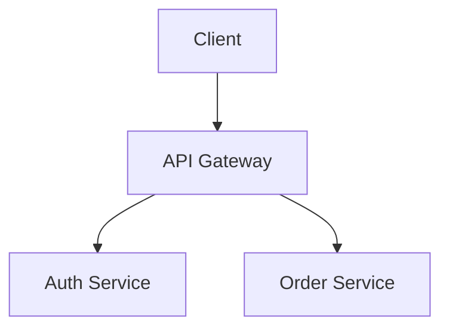
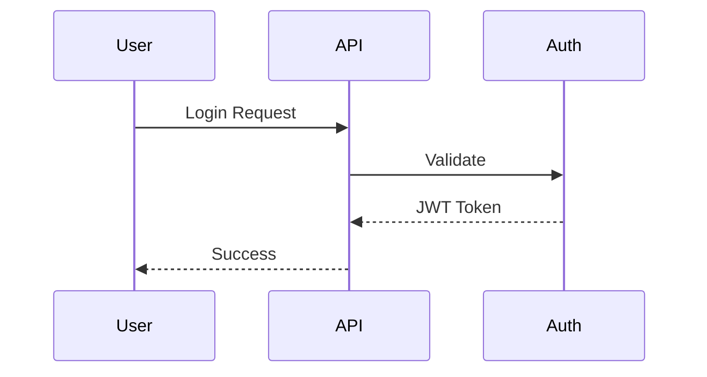
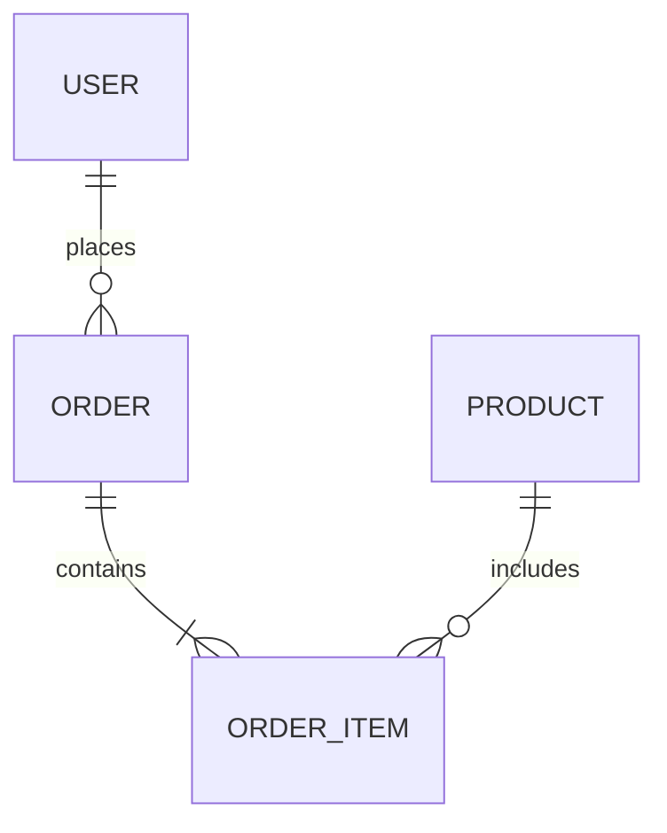
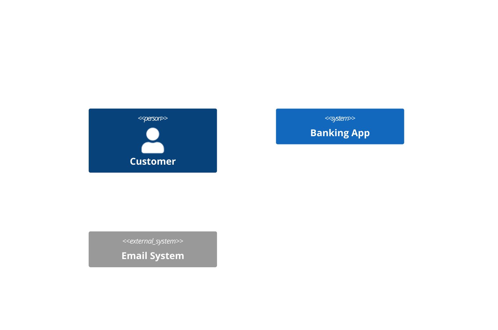
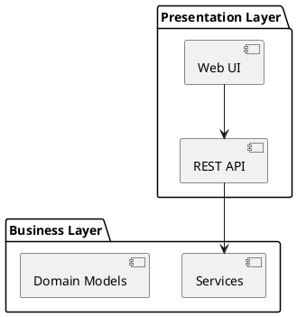

# Code Architect Plugin

**Version**: 1.0.0
**Author**: Yannick De Backer (yannick@kobozo.eu)

Generate comprehensive architecture documentation with dependency graphs, visualizations, and system design documents for your codebase.

## Table of Contents

- [Overview](#overview)
- [Features](#features)
- [Installation](#installation)
- [Commands](#commands)
  - [analyze-architecture](#analyze-architecture)
  - [generate-docs](#generate-docs)
- [Agents](#agents)
  - [Architecture Mapper](#architecture-mapper)
  - [Dependency Analyzer](#dependency-analyzer)
  - [Documentation Generator](#documentation-generator)
- [MCP Server Integration](#mcp-server-integration)
- [Documentation Types](#documentation-types)
- [Workflow Examples](#workflow-examples)
- [Best Practices](#best-practices)
- [Output Structure](#output-structure)

## Overview

The Code Architect plugin provides a complete suite of tools for analyzing, visualizing, and documenting software architecture. It leverages AST parsing, multiple diagram formats, and intelligent documentation generation to create professional architecture documentation.

### Key Features

- **Automated Architecture Analysis**: Analyze codebase structure and identify architectural patterns
- **Dependency Mapping**: Extract import/export relationships, detect circular dependencies
- **Multi-Format Diagrams**: Generate C4 models, UML diagrams, Mermaid charts, D2 diagrams
- **Comprehensive Documentation**: Create system design docs, ADRs, component specs
- **Visual Insights**: Dependency graphs, data flow diagrams, deployment architecture
- **Best Practice Templates**: Industry-standard templates for all documentation types

## Installation

This plugin is part of the Claude Code plugin ecosystem. To install:

1. Clone the kobozo-plugins repository
2. The plugin will be automatically available in Claude Code
3. Ensure required MCP servers are installed (see [MCP Server Integration](#mcp-server-integration))

## Commands

### analyze-architecture

Perform a complete architectural analysis of your codebase with dependency graphs, component mapping, and visual diagrams.

#### Usage

```bash
/analyze-architecture [--output=docs/architecture] [--format=markdown|html]
```

#### Examples

```bash
# Basic analysis with default output
/analyze-architecture

# Specify custom output directory
/analyze-architecture --output=docs/architecture

# Generate HTML format documentation
/analyze-architecture --format=html

# Deep analysis with file-level details
/analyze-architecture --deep

# Focus on specific directory
/analyze-architecture --focus=services

# Include complexity metrics
/analyze-architecture --with-metrics
```

#### Execution Flow

**Phase 1: Dependency Analysis**
1. Launch dependency-analyzer agent
2. Parse codebase using AST (ast-grep, code-to-tree MCP servers)
3. Extract import/export relationships
4. Detect circular dependencies
5. Identify unused dependencies
6. Generate dependency graphs using Mermaid MCP server

**Outputs:**
- Dependency tree visualization
- Circular dependency report
- Unused dependency list
- Module relationship graph

**Phase 2: Architecture Mapping**
1. Launch architecture-mapper agent
2. Identify architectural pattern (microservices, layered, etc.)
3. Map component boundaries and relationships
4. Generate C4 model diagrams using UML-MCP server
5. Create sequence diagrams for key flows
6. Document deployment architecture

**Outputs:**
- C4 Context diagram
- C4 Container diagram
- C4 Component diagrams
- Sequence diagrams for critical flows
- Deployment architecture diagram

**Phase 3: Documentation Generation**
1. Launch documentation-generator agent
2. Compile analysis results
3. Generate architecture overview document
4. Create component documentation
5. Document data models and relationships

**Outputs:**
- Architecture overview (markdown)
- Component documentation
- Data model documentation
- Technology stack inventory

#### Analysis Report Contents

**1. Executive Summary**
- Architecture style identified
- Total components/modules
- Critical issues found
- Recommendations

**2. Dependency Analysis**
- Module dependency graph (visual)
- Circular dependencies (with paths)
- Unused dependencies
- Missing dependencies
- Dependency depth analysis

**3. Component Architecture**
- C4 Context diagram
- C4 Container diagram
- Component relationships
- Integration points
- API contracts

**4. Data Architecture**
- Entity relationship diagram
- Database schema overview
- Data flow patterns
- Caching strategy

**5. Recommendations**
- Architecture improvements
- Refactoring opportunities
- Technical debt items
- Performance optimizations

#### When to Use

- Starting work on an unfamiliar codebase
- Before major refactoring
- During architecture reviews
- For onboarding documentation
- When planning system migrations
- To identify technical debt

### generate-docs

Generate complete architecture documentation package with ADRs, component specifications, and system design documents.

#### Usage

```bash
/generate-docs [--type=full|adr|component] [--component=<name>]
```

#### Examples

```bash
# Generate full documentation suite (default)
/generate-docs

# Create new ADR template
/generate-docs --type=adr

# Generate documentation for specific component
/generate-docs --type=component --component=auth-service
```

#### Execution Flow

**Full Documentation Mode (default)**

**Phase 1: Architecture Overview**
1. Launch architecture-mapper agent
2. Generate system context documentation
3. Create C4 model diagrams (Context, Container, Component)
4. Document architectural patterns used
5. Map technology stack

**Outputs:**
- `docs/architecture/README.md` - Overview with diagrams
- `docs/architecture/system-context.md` - High-level system view
- `docs/architecture/patterns.md` - Architectural patterns documentation

**Phase 2: Component Documentation**
1. Launch documentation-generator agent
2. Identify all major components/services
3. Generate component documentation for each
4. Document API contracts and interfaces
5. Map component dependencies

**Outputs:**
- `docs/components/<component-name>.md` for each component
- API documentation
- Interface specifications

**Phase 3: Data Documentation**
1. Analyze data models and schemas
2. Generate entity relationship diagrams
3. Document data flows
4. Create data dictionary

**Outputs:**
- `docs/data/data-model.md` - Complete data model
- `docs/data/er-diagram.svg` - ER diagram
- `docs/data/data-flows.md` - Data flow documentation

**Phase 4: ADR Framework Setup**
1. Create ADR directory structure
2. Generate ADR template
3. Create ADR index
4. Document existing key decisions

**Outputs:**
- `docs/adr/README.md` - ADR index and guidelines
- `docs/adr/template.md` - ADR template
- `docs/adr/0001-*.md` - Initial ADRs for major decisions

**ADR Mode (--type=adr)**

Create a new Architectural Decision Record with interactive prompts:
- Decision title
- Context and problem statement
- Options considered
- Decision outcome
- Rationale

**Output:**
- New ADR file: `docs/adr/00XX-decision-title.md`
- Updated index: `docs/adr/README.md`

**Component Mode (--type=component)**

Generate documentation for a specific component:

**Output:**
- `docs/components/<component-name>.md` with:
  - Purpose and responsibilities
  - Architecture diagram
  - API documentation
  - Dependencies
  - Configuration
  - Monitoring metrics
  - Testing approach

#### When to Use

**Full Documentation** (`/generate-docs`):
- New project setup
- Major refactoring completion
- Before architecture review
- For onboarding materials

**ADR Mode** (`/generate-docs --type=adr`):
- Before making significant architectural decision
- To document past decisions retroactively
- When changing architectural direction

**Component Mode** (`/generate-docs --type=component`):
- New service/component created
- Major component refactoring
- API changes
- For component handoff

## Agents

### Architecture Mapper

**Purpose**: Map system architecture, generate UML diagrams, C4 models, and visualize component relationships.

**Model**: Claude Sonnet
**Color**: Purple

#### Capabilities

- Identify architectural patterns (MVC, microservices, layered, event-driven)
- Map component boundaries and relationships
- Generate multi-format diagrams (C4, UML, Mermaid, D2, PlantUML)
- Document data flows and API contracts
- Visualize deployment architecture

#### MCP Servers Used

- **uml-mcp**: Generate UML, PlantUML, Mermaid, D2, GraphViz diagrams
- **diagram-bridge-mcp**: Intelligent diagram format selection with Kroki rendering
- **@longjianjiang/mermaid-mcp-server**: Generate and render Mermaid diagrams

#### Supported Diagram Types

**UML Diagrams**:
- Class diagrams
- Sequence diagrams
- Activity diagrams
- State diagrams
- Use case diagrams

**Architecture Diagrams**:
- C4 Model (Context, Container, Component, Code)
- Component diagrams
- Deployment diagrams
- BPMN process diagrams

**Data Diagrams**:
- Entity-Relationship diagrams
- Data flow diagrams
- Graph visualizations

#### Architecture Patterns Recognized

1. **C4 Model Architecture**: System Context, Container, Component levels
2. **Microservices Architecture**: Service mesh, API gateway, event-driven
3. **Layered Architecture**: Presentation, Application, Domain, Infrastructure
4. **Event-Driven Architecture**: Event bus, pub/sub, event sourcing
5. **Hexagonal Architecture**: Ports and adapters pattern

### Dependency Analyzer

**Purpose**: Analyze code dependencies, detect circular dependencies, and generate dependency graphs using AST parsing.

**Model**: Claude Sonnet
**Color**: Cyan

#### Capabilities

- Parse code into Abstract Syntax Trees (AST)
- Extract import/export relationships across languages
- Detect circular dependencies with path visualization
- Identify unused dependencies
- Generate dependency graphs and visualizations
- Calculate dependency depth and complexity

#### MCP Servers Used

- **@ast-grep/mcp**: AST-based code analysis for pattern matching
- **code-to-tree**: Language-agnostic AST parsing using tree-sitter
- **@longjianjiang/mermaid-mcp-server**: Dependency graph visualization

#### Supported Languages

- JavaScript/TypeScript
- Python
- Go
- Rust
- Java
- C/C++
- Ruby

#### Analysis Types

**Import Analysis**:
- ES6 imports/exports
- CommonJS require/module.exports
- Python imports
- Go imports
- Language-specific module systems

**Circular Dependency Detection**:
- Depth-first search algorithm
- Full cycle path visualization
- Impact analysis
- Resolution recommendations

**Unused Dependencies**:
- Compare package.json with actual imports
- Identify orphaned packages
- Calculate potential savings

#### Report Format

```markdown
# Dependency Analysis Report

## Summary
- Total Modules: 247
- External Dependencies: 42
- Circular Dependencies: 3 (Critical)
- Unused Dependencies: 5
- Deeply Nested: 12 (depth > 5)

## Issues Found

### Critical: Circular Dependencies
1. services/auth.ts ↔ services/user.ts ↔ services/session.ts
   - Severity: High
   - Recommendation: Extract shared interfaces

### Warnings: Unused Dependencies
- lodash (saves 850KB)
- moment (replaced by date-fns)

## Visualizations
[Dependency graphs, module trees, circular dependency highlights]

## Recommendations
[Actionable steps to improve architecture]
```

### Documentation Generator

**Purpose**: Generate comprehensive architecture documentation including system design docs, technical specs, and ADRs.

**Model**: Claude Sonnet
**Color**: Green

#### Capabilities

- System design documents with diagrams
- Architectural Decision Records (ADRs)
- Technical specifications
- Component documentation with interfaces
- Data model documentation
- API documentation integration

#### Documentation Standards

**Markdown Formatting**:
- GitHub-flavored markdown
- Table of contents for long documents
- Relative links between documents
- Line length under 120 characters

**Diagram Standards**:
- Store source code (Mermaid, PlantUML, D2) in docs
- Generate SVG/PNG for viewing
- Consistent color schemes
- Labeled connections and components

**Version Control**:
- Commit docs with related code changes
- Meaningful commit messages
- Tag documentation versions
- Archive deprecated docs (don't delete)

#### Templates Provided

**1. Architecture Overview Template**:
- System purpose and scope
- High-level architecture diagram
- Technology stack
- Key architectural decisions
- Cross-cutting concerns

**2. ADR Template (MADR Format)**:
- Context and problem statement
- Decision drivers
- Considered options (with pros/cons)
- Decision outcome
- Consequences
- Validation criteria

**3. Component Documentation Template**:
- Component overview and responsibilities
- Architecture diagram
- API/Interface documentation
- Dependencies
- Configuration
- Monitoring
- Testing approach

**4. Data Model Template**:
- Entity descriptions
- Relationships
- Business rules
- Indexes and constraints
- Data retention policies

## MCP Server Integration

The plugin integrates with multiple MCP servers for advanced analysis and visualization:

### AST Analysis

**@ast-grep/mcp**:
- Pattern-based code structure analysis
- Fast AST pattern matching
- Multi-language support

**code-to-tree**:
- Language-agnostic AST parsing
- Tree-sitter based parsing
- No runtime dependencies

### Visualization

**@longjianjiang/mermaid-mcp-server**:
- Dependency graphs
- Flow diagrams
- Sequence diagrams
- ER diagrams

**uml-mcp**:
- UML diagrams (Class, Sequence, Activity, State)
- PlantUML support
- C4 model diagrams
- D2 diagrams
- GraphViz graphs
- BPMN diagrams

**diagram-bridge-mcp**:
- Intelligent diagram rendering via Kroki
- Automatic format selection
- Multiple output formats (SVG, PNG, PDF)

## Documentation Types

### 1. Architecture Overview

Complete system architecture documentation with:
- Executive summary
- System context and boundaries
- Architecture style and rationale
- Key components and their relationships
- Data architecture
- Cross-cutting concerns (security, monitoring, error handling)
- Future considerations and technical debt

### 2. Architectural Decision Records (ADRs)

Industry-standard ADR format (MADR):
- Context and problem statement
- Decision drivers
- Considered options with pros/cons
- Decision outcome and rationale
- Positive and negative consequences
- Implementation action items
- Validation metrics
- Links to related decisions

**Example ADR Topics**:
- Technology stack choices
- Database selection
- Architecture pattern decisions
- API design approaches
- Security implementations

### 3. Component Documentation

Detailed component specifications:
- Purpose and responsibilities
- Architecture diagrams
- Public API/Interface documentation
- Dependencies (direct and transitive)
- Configuration options
- Error handling strategies
- Monitoring metrics and SLOs
- Testing approach and coverage
- Security considerations
- Known issues and future improvements

### 4. Data Model Documentation

Complete data architecture:
- Entity-Relationship diagrams
- Table schemas with columns, types, constraints
- Indexes and performance optimization
- Relationships and foreign keys
- Business rules and validation
- Normalization decisions
- Data retention policies
- Privacy and encryption requirements

### 5. API Documentation

RESTful and GraphQL API documentation:
- Endpoint specifications
- Request/response formats
- Authentication requirements
- Rate limiting
- Error codes
- Usage examples
- Webhook documentation

## Workflow Examples

### Example 1: New Project Documentation

```bash
# Step 1: Analyze the codebase architecture
/analyze-architecture --output=docs/architecture

# Step 2: Review the analysis report
# Read: docs/architecture/dependency-analysis.md
# Identify: Circular dependencies and architectural issues

# Step 3: Generate complete documentation
/generate-docs

# Step 4: Review generated documentation
# Check: docs/architecture/README.md
# Review: docs/components/*.md
# Validate: docs/adr/README.md

# Step 5: Commit to repository
git add docs/
git commit -m "docs: Add comprehensive architecture documentation"
```

### Example 2: Document Architectural Decision

```bash
# Step 1: Create new ADR
/generate-docs --type=adr

# Step 2: Follow interactive prompts
# - Decision title: "Use PostgreSQL for primary database"
# - Context: Explain the need and constraints
# - Options: List alternatives (MongoDB, MySQL, etc.)
# - Decision: Document the chosen option
# - Rationale: Explain why

# Step 3: Review generated ADR
# File: docs/adr/0003-use-postgresql.md

# Step 4: Commit with code changes
git add docs/adr/0003-use-postgresql.md
git commit -m "docs: ADR-003 - Choose PostgreSQL as primary database"
```

### Example 3: Component Refactoring Documentation

```bash
# Step 1: Analyze component before refactoring
/analyze-architecture --focus=src/services/auth

# Step 2: Perform refactoring
# ... make code changes ...

# Step 3: Generate updated component docs
/generate-docs --type=component --component=auth-service

# Step 4: Review changes
# Compare: Old vs new architecture diagrams
# Validate: API changes are documented

# Step 5: Commit together
git add src/services/auth docs/components/auth-service.md
git commit -m "refactor(auth): Simplify authentication flow

Updated component documentation to reflect new architecture."
```

### Example 4: Integration with API Documenter

```bash
# Step 1: Analyze architecture
/analyze-architecture

# Step 2: Generate API documentation (using api-documenter plugin)
/generate-api-docs --format=openapi

# Step 3: Generate full architecture docs
/generate-docs

# Result: docs/ contains both architecture and API documentation
# - docs/architecture/ - System architecture
# - docs/api/ - OpenAPI specifications
# - docs/components/ - Component docs with API references
```

### Example 5: Quarterly Documentation Review

```bash
# Step 1: Re-analyze current codebase
/analyze-architecture --with-metrics

# Step 2: Compare with previous analysis
# Check: Has technical debt increased?
# Identify: New circular dependencies

# Step 3: Update documentation
/generate-docs

# Step 4: Create improvement ADR if needed
/generate-docs --type=adr
# Title: "Address circular dependencies in service layer"

# Step 5: Create tracking issue
# Link to ADR and analysis report
```

## Best Practices

### 1. Keep Documentation Close to Code

- Store in `/docs` directory in repository
- Update docs in same PR as code changes
- Version control all documentation
- Review docs as part of code review

### 2. Document Decisions, Not Just Designs

- Create ADR for every significant architectural decision
- Include rationale and trade-offs
- Link related decisions
- Update ADRs when superseded

### 3. Make Diagrams From Code

- Use diagram-as-code (Mermaid, PlantUML, D2)
- Keep diagram source in repository
- Generate images during build
- Update diagrams when architecture changes

### 4. Write for Your Audience

- **New Developers**: Getting started guides, architecture overview
- **Experienced Developers**: Component specs, API documentation
- **Architects**: High-level diagrams, ADRs, design patterns
- **Operators**: Deployment architecture, monitoring, troubleshooting

### 5. Keep It Current

- Review documentation quarterly
- Mark outdated sections clearly
- Delete obsolete content
- Use "Last Updated" dates

### 6. Make It Searchable

- Use consistent terminology
- Include glossary for domain terms
- Tag with keywords
- Create comprehensive index

### 7. Visual First

- Include diagram in every major section
- Use diagrams to explain, text to detail
- Consistent color schemes
- Label all connections

### 8. Living Documentation

- Generate from code when possible
- Automate documentation updates
- Integrate with CI/CD pipeline
- Alert when docs drift from code

### 9. Comprehensive but Concise

- Focus on "why" not just "what"
- Include examples for clarity
- Use tables for structured data
- Keep line length readable

### 10. Integration with Development Workflow

```bash
# Pre-commit hook to update docs
#!/bin/bash
if [[ $(git diff --cached --name-only | grep -E "src/") ]]; then
  echo "Code changes detected, updating architecture docs..."
  /analyze-architecture --quick
fi
```

## Output Structure

Complete documentation structure generated by this plugin:

```
docs/
├── README.md                          # Documentation index
├── architecture/
│   ├── README.md                      # Architecture overview
│   ├── dependency-analysis.md         # Dependency tree and issues
│   ├── system-context.md              # System context
│   ├── container-diagram.md           # Container architecture
│   ├── component-architecture.md      # Component details
│   ├── data-architecture.md           # Data models
│   ├── deployment.md                  # Deployment architecture
│   └── patterns.md                    # Architectural patterns
├── adr/                               # Architectural Decision Records
│   ├── README.md                      # ADR index
│   ├── template.md                    # ADR template
│   ├── 0001-use-microservices.md
│   ├── 0002-choose-react.md
│   └── 0003-use-postgresql.md
├── components/                        # Component documentation
│   ├── auth-service.md
│   ├── user-service.md
│   ├── order-service.md
│   └── payment-service.md
├── api/                               # API documentation
│   ├── rest-api.md
│   └── graphql-schema.md
├── data/                              # Data documentation
│   ├── data-model.md
│   ├── er-diagram.svg
│   ├── data-flows.md
│   └── migrations/
│       └── README.md
└── diagrams/                          # Generated diagrams
    ├── system-context.svg
    ├── container.svg
    ├── dependency-graph.svg
    └── components/
        ├── auth-service.svg
        ├── user-service.svg
        └── order-service.svg
```

## Advanced Features

### Mermaid Diagram Support

The plugin generates various Mermaid diagrams:

**Flow Diagrams**:


**Sequence Diagrams**:


**Entity-Relationship Diagrams**:


**C4 Model Diagrams**:


### PlantUML Support

**Component Diagrams**:


### D2 Diagram Support

**Modern Architecture Diagrams**:
```d2
direction: right
api_gateway: API Gateway {
  shape: hexagon
}
services: {
  auth: Auth Service
  user: User Service
}
api_gateway -> services.auth
api_gateway -> services.user
```

## Contributing

To contribute to this plugin:

1. Fork the repository
2. Create a feature branch
3. Make your changes
4. Add tests if applicable
5. Submit a pull request

## License

MIT License - see LICENSE file for details

## Support

For issues, questions, or contributions:
- GitHub Issues: [kobozo-plugins](https://github.com/yannickdekoninck/kobozo-plugins)
- Email: yannick@kobozo.eu

---

**Created with Code Architect Plugin v1.0.0**
