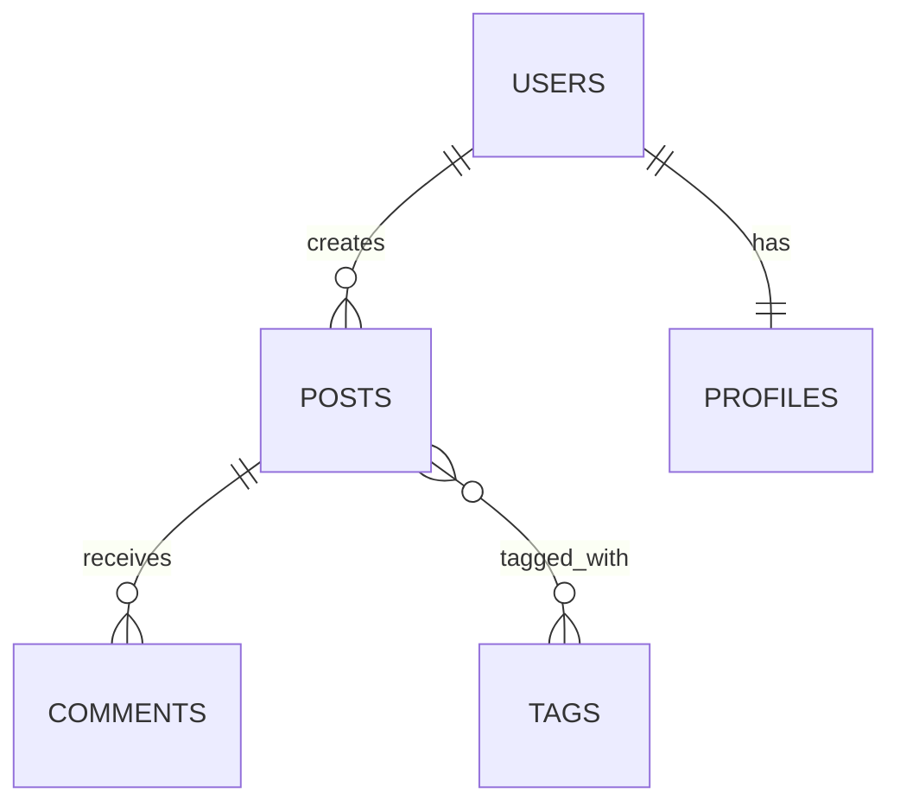

# Database Schema Manager Plugin

**Version:** 1.0.0
**Author:** Yannick De Backer (yannick@kobozo.eu)

## Overview

The Database Schema Manager is a comprehensive Claude Code plugin for analyzing, designing, and managing database schemas. It provides powerful tools for schema analysis, migration generation, and data modeling across multiple database systems and ORM frameworks.

### Key Features

- **Comprehensive Schema Analysis** - Analyze existing databases for issues, optimization opportunities, and documentation
- **Safe Migration Generation** - Create reversible, zero-downtime database migrations with rollback support
- **Data Modeling** - Design optimal database schemas from requirements with proper normalization
- **Multi-Database Support** - Works with PostgreSQL, MySQL, MongoDB, and more
- **ORM Integration** - Supports Sequelize, TypeORM, Prisma, Django, Rails, and other popular ORMs
- **Relationship Mapping** - Automatically detect and visualize entity relationships
- **Performance Optimization** - Identify missing indexes, redundant indexes, and query bottlenecks
- **Documentation Generation** - Auto-generate ER diagrams, data dictionaries, and schema documentation

---

## Table of Contents

- [Installation](#installation)
- [Commands](#commands)
  - [/analyze-schema](#analyze-schema)
  - [/generate-migration](#generate-migration)
- [Agents](#agents)
  - [schema-analyzer](#schema-analyzer)
  - [migration-generator](#migration-generator)
  - [data-modeler](#data-modeler)
- [Supported Technologies](#supported-technologies)
- [Use Cases](#use-cases)
- [Workflow Examples](#workflow-examples)
- [Best Practices](#best-practices)

---

## Installation

This plugin is part of the kobozo-plugins collection. To install:

```bash
# Clone the repository
git clone https://github.com/yannickdekoninck/kobozo-plugins.git

# Navigate to plugins directory
cd kobozo-plugins/plugins/db-schema-manager

# The plugin is ready to use with Claude Code
```

**Requirements:**
- Claude Code CLI
- Access to database (for schema analysis)
- Appropriate database drivers installed

---

## Commands

### /analyze-schema

Performs comprehensive database schema analysis with optimization recommendations, issue detection, and documentation generation.

**Usage:**
```
/analyze-schema [database-type]
```

**Parameters:**
- `database-type` (optional, auto-detected):
  - `postgres` / `postgresql`
  - `mysql`
  - `mongodb`
  - `orm` - Analyze from ORM models (Sequelize, TypeORM, Django, Rails, Prisma)

**Example:**
```
/analyze-schema postgres
/analyze-schema
```

**What It Does:**

1. **Schema Discovery**
   - Detects database type and ORM framework
   - Extracts all tables, columns, data types, and constraints
   - Queries information_schema for relational databases
   - Samples collections for MongoDB structure

2. **Relationship Analysis**
   - Maps all foreign key relationships
   - Determines cardinality (1:1, 1:N, M:N)
   - Identifies missing foreign keys
   - Detects orphaned records
   - Generates entity-relationship diagrams

3. **Issue Detection**
   - **Critical Issues:**
     - Missing primary keys
     - Foreign keys without indexes
     - Denormalization violations (1NF)
     - Orphaned data
   - **High Priority:**
     - Normalization issues (2NF, 3NF)
     - Inefficient data types
     - Nullable foreign keys
     - Missing composite indexes
   - **Medium Priority:**
     - Over-normalization
     - Unused indexes
     - Redundant indexes
     - Inconsistent naming

4. **Optimization Recommendations**
   - Index suggestions (add, remove, optimize)
   - Schema improvements
   - Data type optimizations
   - Performance enhancements

5. **Documentation Generation**
   - Comprehensive schema documentation
   - ER diagram in Mermaid format
   - Data dictionary
   - Migration scripts for all fixes

**Output Includes:**
- Executive summary with health score
- Entity-relationship diagram
- Table overview with statistics
- Detailed issue reports with fixes
- Performance projections
- Implementation roadmap
- Migration scripts
- Testing checklist

**When to Use:**
- New project database design review
- Pre-deployment schema validation
- Performance troubleshooting
- Database refactoring planning
- Quarterly health checks
- Before major migrations
- Technical debt assessment

---

### /generate-migration

Creates safe, reversible database migration scripts with up/down migrations and comprehensive testing instructions.

**Usage:**
```
/generate-migration <change-description>
```

**Parameters:**
- `change-description` - Description of the schema change to make

**Examples:**
```
/generate-migration add email_verified to users
/generate-migration rename column old_name to new_name in users
/generate-migration create posts table
/generate-migration add index on users.email
```

**What It Does:**

1. **Change Detection**
   - Parses change description
   - Detects migration framework in use
   - Determines appropriate migration strategy

2. **Migration Design**
   - Identifies migration type (add/remove column, table creation, index, etc.)
   - Designs zero-downtime strategy where applicable
   - Uses expand-contract pattern for breaking changes
   - Plans concurrent index creation
   - Designs backfill strategies for NOT NULL constraints

3. **Script Generation**
   - Generates up migration (apply changes)
   - Generates down migration (rollback)
   - Adds transaction safety
   - Includes verification queries
   - Provides timing estimates

4. **Safety Analysis**
   - Assesses impact (table locks, affected rows, downtime)
   - Identifies risks (data loss, compatibility, performance)
   - Provides rollback safety assessment

5. **Testing Instructions**
   - Development testing commands
   - Staging deployment steps
   - Production deployment checklist
   - Monitoring guidelines
   - Rollback procedures

**Supported Migration Frameworks:**
- Sequelize (Node.js)
- TypeORM (TypeScript)
- Prisma
- Django (Python)
- Rails (Ruby)
- Flyway (Java)
- Liquibase (Java/XML)
- Raw SQL (framework-agnostic)

**Output Includes:**
- Migration summary and impact assessment
- Generated migration files for target framework
- Alternative framework implementations
- Detailed testing guide (development, staging, production)
- Rollback procedures
- Verification queries
- Monitoring instructions

**When to Use:**
- Adding/removing database columns
- Creating new tables
- Changing column types
- Adding/removing indexes
- Refactoring relationships
- Data transformations
- Schema normalization

---

## Agents

### schema-analyzer

**Purpose:** Analyzes database schemas to identify relationships, detect issues, suggest optimizations, and generate documentation.

**Tools:** Bash, Read, Glob, Grep, TodoWrite
**Model:** Sonnet
**Color:** Blue

**Core Capabilities:**

1. **Schema Discovery**
   - Query information_schema for relational databases
   - Sample MongoDB collections for structure
   - Parse ORM model files (Sequelize, TypeORM, Django, Rails, Prisma)
   - Extract tables, columns, data types, and constraints

2. **Relationship Mapping**
   - Identify foreign key relationships
   - Determine relationship types (1:1, 1:N, M:N, self-referential, polymorphic)
   - Map relationship cardinality
   - Detect missing or broken relationships

3. **Issue Detection**
   - Missing primary keys
   - Foreign keys without indexes
   - Denormalization violations
   - Data type inefficiencies
   - Nullable foreign keys
   - Large tables with too many columns

4. **Normalization Analysis**
   - First Normal Form (1NF) compliance
   - Second Normal Form (2NF) compliance
   - Third Normal Form (3NF) compliance
   - Violation identification with fixes

5. **Index Analysis**
   - Missing indexes (especially on foreign keys)
   - Unused indexes
   - Redundant indexes
   - Composite index recommendations

6. **Performance Projections**
   - Query performance improvements
   - Disk space savings
   - Write performance impact
   - Index efficiency scores

**Query Examples:**

PostgreSQL schema queries:
```sql
-- Get all tables
SELECT tablename, schemaname
FROM pg_tables
WHERE schemaname NOT IN ('pg_catalog', 'information_schema');

-- Get foreign key relationships
SELECT tc.table_name, kcu.column_name, ccu.table_name AS foreign_table_name
FROM information_schema.table_constraints AS tc
JOIN information_schema.key_column_usage AS kcu ON tc.constraint_name = kcu.constraint_name
JOIN information_schema.constraint_column_usage AS ccu ON ccu.constraint_name = tc.constraint_name
WHERE tc.constraint_type = 'FOREIGN KEY';
```

**Output Format:**
- Executive summary with health score
- Entity-relationship diagram (Mermaid)
- Critical/high/medium priority issues
- Normalization assessment
- Index optimization plan
- Performance projections
- Migration plan with timeline

---

### migration-generator

**Purpose:** Generates database migration scripts for schema changes with support for multiple ORMs and zero-downtime deployments.

**Tools:** Bash, Read, Glob, Grep, TodoWrite, Write
**Model:** Sonnet
**Color:** Green

**Core Capabilities:**

1. **Multi-Framework Support**
   - Sequelize (Node.js) - JavaScript migrations
   - TypeORM (TypeScript) - Class-based migrations
   - Prisma - Schema-based migrations
   - Django (Python) - Python migrations
   - Rails (Ruby) - Ruby migrations
   - Flyway (Java) - SQL migrations
   - Liquibase - XML/YAML changesets
   - Raw SQL - Framework-agnostic

2. **Migration Patterns**
   - Add/remove columns
   - Rename columns (zero-downtime)
   - Change column types (expanding/contracting)
   - Create/drop tables
   - Add/remove indexes (concurrent)
   - Add/remove foreign keys
   - Data migrations and transformations

3. **Zero-Downtime Strategies**
   - Expand-contract pattern for breaking changes
   - Concurrent index creation (PostgreSQL)
   - Backfill strategies for NOT NULL constraints
   - Blue-green schema deployment
   - Dual-writing during transitions

4. **Safety Features**
   - Transaction wrapping
   - Rollback procedures
   - Data validation before type changes
   - Verification queries
   - Impact assessment (locks, affected rows, downtime)

5. **Testing Support**
   - Development environment commands
   - Staging deployment steps
   - Production deployment checklist
   - Monitoring guidelines
   - Rollback procedures

**Migration Examples:**

Add column (Sequelize):
```javascript
module.exports = {
  async up(queryInterface, Sequelize) {
    await queryInterface.addColumn('users', 'email_verified', {
      type: Sequelize.BOOLEAN,
      defaultValue: false,
      allowNull: false
    });
  },
  async down(queryInterface, Sequelize) {
    await queryInterface.removeColumn('users', 'email_verified');
  }
};
```

Concurrent index (PostgreSQL):
```sql
-- Up
CREATE INDEX CONCURRENTLY idx_users_email ON users(email);

-- Down
DROP INDEX CONCURRENTLY idx_users_email;
```

**Output Format:**
- Migration summary and metadata
- Impact assessment (risk level, downtime, affected rows)
- Generated migration files for target framework
- Alternative framework implementations
- Testing guide (dev/staging/production)
- Rollback procedures
- Verification queries

---

### data-modeler

**Purpose:** Designs optimal database schemas from requirements with proper normalization, relationships, and ORM code generation.

**Tools:** Bash, Read, Glob, Grep, TodoWrite, Write
**Model:** Sonnet
**Color:** Purple

**Core Capabilities:**

1. **Requirements Analysis**
   - Extract entities from business requirements
   - Identify attributes for each entity
   - Determine attribute data types
   - Define validation rules and constraints

2. **Relationship Design**
   - One-to-One (1:1) relationships
   - One-to-Many (1:N) relationships
   - Many-to-Many (M:N) with junction tables
   - Self-referential relationships
   - Polymorphic associations (with caveats)

3. **Normalization**
   - First Normal Form (1NF) - Atomic values, no repeating groups
   - Second Normal Form (2NF) - No partial dependencies
   - Third Normal Form (3NF) - No transitive dependencies
   - Denormalization when performance requires it

4. **Data Type Selection**
   - Identifiers (SERIAL, UUID)
   - Strings (VARCHAR, CHAR, TEXT)
   - Numbers (SMALLINT, INTEGER, BIGINT, DECIMAL)
   - Booleans
   - Dates/Times (TIMESTAMP, DATE, INTERVAL)
   - JSON/JSONB
   - Arrays (PostgreSQL)
   - Enums

5. **Indexing Strategy**
   - Primary key indexes (automatic)
   - Foreign key indexes (always recommended)
   - Unique constraints
   - Query-based indexes (WHERE, ORDER BY)
   - Composite indexes
   - Partial indexes
   - Full-text search indexes

6. **Constraint Design**
   - NOT NULL constraints
   - CHECK constraints (validation)
   - Foreign key cascade actions (CASCADE, SET NULL, RESTRICT)
   - Unique constraints

7. **ORM Code Generation**
   - Sequelize models (Node.js)
   - TypeORM entities (TypeScript)
   - Prisma schema
   - Django models (Python)
   - Rails models (Ruby)

**Example Output:**

Entity-Relationship Diagram (Mermaid):


Sequelize Model:
```javascript
class User extends Model {
  static associate(models) {
    User.hasMany(models.Post, { foreignKey: 'userId', as: 'posts' });
    User.hasOne(models.Profile, { foreignKey: 'userId', as: 'profile' });
  }
}
```

**Output Format:**
- Entity overview
- Entity-relationship diagram (Mermaid)
- Table definitions with SQL
- Relationship documentation
- Generated ORM models for multiple frameworks
- Indexing strategy table
- Next steps for implementation

---

## Supported Technologies

### Databases

- **PostgreSQL** - Full support including advanced features (JSONB, arrays, partial indexes)
- **MySQL** - Full support for relational features
- **MongoDB** - Schema analysis via collection sampling
- **SQL Server** - Via information_schema queries
- **SQLite** - Via information_schema or direct queries

### ORM Frameworks

- **Sequelize** (Node.js) - JavaScript/TypeScript migrations and models
- **TypeORM** (Node.js/TypeScript) - Class-based entities and migrations
- **Prisma** (Node.js) - Schema-based migrations
- **Django** (Python) - Python migrations and models
- **Rails** (Ruby) - Ruby migrations and models
- **Flyway** (Java) - SQL-based migrations
- **Liquibase** (Java) - XML/YAML changesets

### Migration Tools

- Framework-specific migration tools (built into ORMs)
- Raw SQL migrations (framework-agnostic)
- Blue-green deployment strategies
- Zero-downtime migration patterns

---

## Use Cases

### 1. Schema Health Check

**Scenario:** You want to assess the health of an existing database before a major refactoring.

**Workflow:**
```
/analyze-schema postgres
```

**Output:** Comprehensive health report with:
- Health score (0-10)
- Critical issues requiring immediate attention
- Performance optimization recommendations
- Normalization violations
- Missing indexes
- Implementation roadmap

### 2. Add New Feature Column

**Scenario:** You need to add an `email_verified` column to track email verification status.

**Workflow:**
```
/generate-migration add email_verified boolean to users table with default false
```

**Output:**
- Migration files for your ORM framework
- Zero-downtime deployment strategy
- Testing instructions for dev/staging/production
- Rollback procedures
- Verification queries

### 3. Design New Schema from Requirements

**Scenario:** You're starting a new blog platform and need to design the database schema.

**Requirements:**
> Users can create blog posts with multiple tags. Posts can have comments from other users. Users have profiles with avatar images.

**Workflow:**
```
# Use the data-modeler agent
Create a database schema for a blog platform with users, posts, tags, comments, and profiles
```

**Output:**
- Entity-relationship diagram
- Normalized table definitions (3NF)
- ORM models for Sequelize/TypeORM/Prisma/Django/Rails
- Indexing strategy
- Relationship documentation

### 4. Optimize Slow Queries

**Scenario:** Your application has slow query performance and you suspect missing indexes.

**Workflow:**
```
/analyze-schema
```

**Output:**
- Missing index recommendations (especially on foreign keys)
- Composite index suggestions for common query patterns
- Unused/redundant index identification
- Performance projections (e.g., "99% faster with recommended indexes")
- Migration scripts to apply changes

### 5. Refactor for Normalization

**Scenario:** You have a `users` table with `phone1`, `phone2`, `phone3` columns that violates 1NF.

**Workflow:**
```
/analyze-schema
# Identifies denormalization violation

/generate-migration normalize phone numbers in users table
```

**Output:**
- New `phone_numbers` table design
- Data migration script to move phone data
- Migration to drop old columns
- Zero-downtime deployment strategy

### 6. Database Migration Between Environments

**Scenario:** You need to safely migrate schema changes from development to production.

**Workflow:**
```
/generate-migration <describe changes>
```

**Output:**
- Migration files tested in development
- Staging deployment checklist
- Production deployment plan with timing estimates
- Rollback procedures if issues occur
- Monitoring queries to verify success

---

## Workflow Examples

### Complete Schema Analysis Workflow

```bash
# 1. Run schema analysis
/analyze-schema postgres

# Output: Comprehensive report with issues and recommendations

# 2. Review critical issues
# - Missing primary key on 'sessions' table
# - Foreign key without index: comments.post_id
# - Denormalization: users.phone1, phone2, phone3

# 3. Generate migrations for critical fixes
/generate-migration add primary key to sessions table

/generate-migration add index on comments.post_id

/generate-migration normalize phone numbers in users table

# 4. Test migrations in development
npx sequelize-cli db:migrate

# 5. Verify fixes
psql -d dev_db -c "\d sessions"  # Check primary key
psql -d dev_db -c "\d comments"  # Check index

# 6. Deploy to staging
NODE_ENV=staging npx sequelize-cli db:migrate

# 7. Run tests and monitor

# 8. Deploy to production (during maintenance window)
NODE_ENV=production npx sequelize-cli db:migrate

# 9. Re-run analysis to verify improvements
/analyze-schema postgres
# New health score: 9.2/10 (was 7.5/10)
```

### Zero-Downtime Column Rename

```bash
# Scenario: Rename 'username' to 'user_name' in production without downtime

# Phase 1: Add new column
/generate-migration add user_name column to users

# Deploy migration
npx sequelize-cli db:migrate

# Phase 2: Update application to write to both columns (dual-write)
# Deploy application update

# Phase 3: Backfill data
/generate-migration backfill user_name from username

npx sequelize-cli db:migrate

# Phase 4: Update application to read from user_name
# Deploy application update

# Phase 5: Remove old column
/generate-migration remove username column from users

npx sequelize-cli db:migrate

# Total downtime: 0 seconds
```

### New Feature Development

```bash
# Scenario: Add user email verification feature

# 1. Generate migration for email_verified column
/generate-migration add email_verified boolean to users with default false

# 2. Generate migration for unique email index
/generate-migration add unique index on users.email

# 3. Review generated migrations
cat migrations/20240115-add-email-verified.js
cat migrations/20240115-add-email-index.js

# 4. Test in development
npx sequelize-cli db:migrate
npm test

# 5. Update application code to use email_verified
# - Send verification emails
# - Check email_verified in authentication

# 6. Deploy to staging
NODE_ENV=staging npx sequelize-cli db:migrate

# 7. Test email verification flow in staging

# 8. Deploy to production
# No downtime required (adding nullable column with default)
NODE_ENV=production npx sequelize-cli db:migrate

# 9. Monitor for issues
tail -f logs/production.log | grep email_verified
```

---

## Best Practices

### Schema Analysis

1. **Run Regular Health Checks**
   - Schedule quarterly schema analysis
   - Review health score trends
   - Address critical issues immediately

2. **Before Major Changes**
   - Always analyze schema before refactoring
   - Understand current relationships
   - Identify technical debt

3. **Monitor Recommendations**
   - Track index usage statistics
   - Review query performance regularly
   - Implement optimization recommendations

### Migration Generation

1. **Always Test First**
   - Test migrations in development
   - Verify in staging environment
   - Create database backups before production

2. **Use Transactions**
   - Wrap migrations in transactions when possible
   - Ensure atomic changes
   - Provide rollback capability

3. **Zero-Downtime Strategies**
   - Use expand-contract pattern for breaking changes
   - Create indexes with CONCURRENTLY flag (PostgreSQL)
   - Backfill data in separate steps
   - Deploy application changes between migration phases

4. **Document Everything**
   - Include comments in migrations
   - Document rollback procedures
   - Provide verification queries
   - Estimate timing and impact

### Data Modeling

1. **Normalize First**
   - Start with 3NF (Third Normal Form)
   - Denormalize only when performance requires it
   - Document denormalization decisions

2. **Index Strategically**
   - Always index foreign keys
   - Index columns used in WHERE clauses
   - Use composite indexes for multi-column queries
   - Monitor index usage and remove unused indexes

3. **Choose Appropriate Data Types**
   - Use smallest type that fits data
   - Use DECIMAL for money (not FLOAT)
   - Use CHAR for fixed-length codes
   - Use TEXT for variable-length content

4. **Define Constraints**
   - Use NOT NULL where appropriate
   - Add CHECK constraints for validation
   - Define foreign key cascade actions thoughtfully
   - Add unique constraints to enforce business rules

5. **Plan for Scale**
   - Consider partitioning for very large tables
   - Design for horizontal scaling if needed
   - Use UUIDs for distributed systems
   - Plan archival strategy for historical data

### Performance Optimization

1. **Index Optimization**
   - Add missing indexes on foreign keys (critical)
   - Create composite indexes for common queries
   - Use partial indexes for filtered queries
   - Remove unused indexes to improve write performance

2. **Query Optimization**
   - Avoid N+1 queries with eager loading
   - Use JOINs efficiently
   - Limit result sets
   - Use database-specific optimizations (EXPLAIN ANALYZE)

3. **Schema Optimization**
   - Normalize to reduce redundancy
   - Denormalize sparingly for read performance
   - Use appropriate data types
   - Archive old data

### Migration Safety

1. **Risk Assessment**
   - Assess impact before migration (locks, downtime, affected rows)
   - Identify reversibility
   - Plan rollback procedures
   - Schedule maintenance windows for risky changes

2. **Backup Strategy**
   - Always backup before production migrations
   - Test restore procedures
   - Keep backups for rollback window
   - Verify backup integrity

3. **Monitoring**
   - Monitor application during deployment
   - Watch for errors in logs
   - Check query performance
   - Verify data integrity after migration

4. **Rollback Planning**
   - Test rollback procedures in staging
   - Document rollback steps
   - Set rollback time limits
   - Consider data preservation during rollback

---

## Contributing

This plugin is part of the kobozo-plugins collection. To contribute:

1. Fork the repository
2. Create a feature branch
3. Make your changes
4. Test thoroughly
5. Submit a pull request

---

## License

This plugin is open source and available under the MIT License.

---

## Support

For issues, questions, or contributions:

- **Email:** yannick@kobozo.eu
- **Repository:** https://github.com/yannickdekoninck/kobozo-plugins
- **Issues:** https://github.com/yannickdekoninck/kobozo-plugins/issues

---

## Changelog

### Version 1.0.0 (Current)

- Initial release
- Schema analysis with health scoring
- Migration generation for multiple frameworks
- Data modeling with ORM code generation
- Support for PostgreSQL, MySQL, MongoDB
- Zero-downtime migration strategies
- Comprehensive documentation generation
