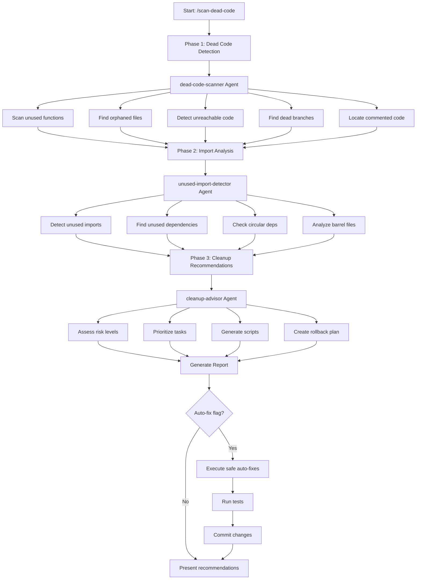

# Dead Code Detector Plugin

**Version:** 1.0.0
**Author:** Yannick De Backer (yannick@kobozo.eu)

A comprehensive Claude Code plugin for detecting and eliminating unutilized code blocks, unused functions, dead imports, and obsolete code paths to maintain a cleaner, more efficient codebase.

---

## Table of Contents

- [Overview](#overview)
- [Features](#features)
- [Installation](#installation)
- [Quick Start](#quick-start)
- [Commands](#commands)
  - [scan-dead-code](#scan-dead-code)
- [Agents](#agents)
  - [dead-code-scanner](#dead-code-scanner)
  - [unused-import-detector](#unused-import-detector)
  - [cleanup-advisor](#cleanup-advisor)
- [What Gets Detected](#what-gets-detected)
- [Workflow & Execution Flow](#workflow--execution-flow)
- [Report Structure](#report-structure)
- [Usage Examples](#usage-examples)
- [Best Practices](#best-practices)
- [Continuous Monitoring](#continuous-monitoring)
- [FAQ](#faq)

---

## Overview

The **Dead Code Detector Plugin** is a powerful tool that helps you maintain a clean, efficient codebase by identifying and safely removing:

- Unused functions and variables
- Unreachable code paths
- Orphaned files with no imports
- Unused imports and exports
- Dead conditional branches
- Commented-out code blocks
- Circular dependencies
- Unused npm dependencies

The plugin uses a three-phase approach with specialized AI agents to detect, analyze, and provide safe removal recommendations with comprehensive risk assessment.

---

## Features

- **Comprehensive Detection**: Finds 8+ types of dead code across your entire codebase
- **Multi-Language Support**: Works with TypeScript, JavaScript, React, and more
- **Risk Assessment**: Categorizes findings by removal risk (low/medium/high)
- **Auto-Fix Capability**: Automatically fixes safe issues like unused imports
- **Detailed Reports**: Generates actionable cleanup reports with step-by-step plans
- **Priority Matrix**: Prioritizes cleanup tasks by impact vs effort
- **Safe Removal Scripts**: Provides automated removal scripts with rollback plans
- **CI/CD Integration**: Ready-to-use configurations for continuous monitoring
- **Bundle Size Analysis**: Estimates bundle size reduction
- **ROI Calculation**: Shows time investment vs savings payback

---

## Installation

This plugin is included in the kobozo-plugins collection. To install it for Claude Code:

```bash
# Clone the repository
git clone https://github.com/yourusername/kobozo-plugins.git

# Navigate to Claude Code plugins directory
cd ~/.config/claude-code/plugins/

# Create symbolic link
ln -s /path/to/kobozo-plugins/plugins/dead-code-detector ./dead-code-detector

# Or copy the plugin
cp -r /path/to/kobozo-plugins/plugins/dead-code-detector ./
```

Verify installation:

```bash
claude-code plugins list
# Should show: dead-code-detector v1.0.0
```

---

## Quick Start

### Basic Scan

Run a full dead code analysis on your project:

```bash
/scan-dead-code
```

This will:
1. Scan for unused functions and orphaned files
2. Detect unused imports and dependencies
3. Generate a comprehensive cleanup report
4. Provide prioritized removal recommendations

### Auto-Fix Mode

Automatically fix safe issues (unused imports):

```bash
/scan-dead-code --auto-fix
```

### Focused Analysis

Focus on specific areas:

```bash
# Only check imports
/scan-dead-code --focus=imports

# Only check orphaned files
/scan-dead-code --focus=files

# Only check unused functions
/scan-dead-code --focus=functions

# Only check dependencies
/scan-dead-code --focus=dependencies
```

---

## Commands

### scan-dead-code

Perform a comprehensive dead code analysis including unused functions, unreachable code, orphaned files, unused imports, and dead dependencies.

#### Usage

```bash
/scan-dead-code [--focus=<area>] [--auto-fix] [--output=<directory>]
```

#### Options

| Option | Type | Description |
|--------|------|-------------|
| `--focus` | string | Narrow analysis to specific area: `imports`, `functions`, `files`, `dependencies` |
| `--auto-fix` | flag | Automatically fix safe issues (unused imports) |
| `--output` | string | Custom output directory for reports (default: current directory) |

#### Examples

```bash
# Full comprehensive analysis
/scan-dead-code

# Focus on unused imports only
/scan-dead-code --focus=imports

# Auto-fix safe issues
/scan-dead-code --auto-fix

# Custom output location
/scan-dead-code --output=docs/cleanup
```

#### Output

The command generates:
- **Main Report** (`dead-code-report.md`): Executive summary and detailed findings
- **Cleanup Scripts**: Automated removal scripts in `scripts/` directory
- **Data Files**: JSON exports in `data/` directory for programmatic access
- **Action Plan**: Step-by-step cleanup roadmap

---

## Agents

The plugin uses three specialized AI agents that work together to provide comprehensive dead code analysis.

### dead-code-scanner

**Purpose**: Detect unused code across your codebase using static analysis tools and AST parsing.

**Capabilities:**
- Scans for unused functions and variables
- Finds unreachable code paths
- Identifies obsolete exports
- Locates dead conditional branches
- Discovers orphaned files
- Detects commented-out code blocks

**Tools Used:**
- `ts-prune` - Find unused TypeScript/JavaScript exports
- `ts-unused-exports` - Detailed TypeScript export analysis
- `knip` - Comprehensive project linting
- `unimported` - Fast orphaned file detection
- ESLint `no-unused-vars` - Variable detection
- Custom AST parsing for unreachable code

**Output Format:**
```typescript
{
  unusedFunctions: [
    { file, line, name, references, lastModified }
  ],
  orphanedFiles: [
    { path, lines, lastModified, references }
  ],
  unreachableCode: [...],
  deadBranches: [...],
  commentedCode: [...]
}
```

### unused-import-detector

**Purpose**: Detect and optimize import statements, identify circular dependencies, and find unused dependencies.

**Capabilities:**
- Detects unused imports in all files
- Finds redundant imports (duplicates from same module)
- Identifies type-only import opportunities
- Detects circular dependencies
- Analyzes barrel file inefficiencies
- Finds unused dependencies in package.json

**Tools Used:**
- ESLint `no-unused-vars`
- TypeScript compiler (`noUnusedLocals`, `noUnusedParameters`)
- `depcheck` - Find unused dependencies
- `madge` - Circular dependency detection

**Output Format:**
```typescript
{
  unusedImports: [
    { file, line, import, from, autoFixable }
  ],
  unusedDependencies: [
    { name, size, lastUsed, inPackageJson }
  ],
  circularDependencies: [
    { cycle, severity }
  ]
}
```

### cleanup-advisor

**Purpose**: Provide safe removal recommendations, prioritize cleanup tasks, and generate automated cleanup scripts.

**Capabilities:**
- Assesses removal risk for each finding (low/medium/high)
- Prioritizes cleanup tasks by impact vs effort
- Generates safe removal scripts
- Creates rollback strategy
- Estimates time and impact
- Provides step-by-step cleanup plan

**Risk Levels:**
- **Low Risk (🟢)**: Private functions, orphaned files, unused imports - Safe to delete
- **Medium Risk (🟡)**: Exported functions, utility modules - Team review recommended
- **High Risk (🔴)**: API endpoints, library exports - Careful analysis required

**Output Format:**
```typescript
{
  quickWins: [
    { task, files, lines, effort, risk, command }
  ],
  mediumPriority: [...],
  highRisk: [...],
  estimatedSavings: {
    totalLines,
    percentageReduction,
    bundleSizeReduction,
    filesRemoved
  }
}
```

---

## What Gets Detected

### 1. Unused Functions

Functions that are never called anywhere in the codebase.

```typescript
// DETECTED: No references found
export function oldCalculation(x: number): number {
  return x * 2;
}

// ALIVE: Used in 5 files
export function currentCalculation(x: number): number {
  return x * 3;
}
```

### 2. Unreachable Code

Code that can never execute due to control flow.

```typescript
function processUser(user: User) {
  if (!user) return null;

  return user.name;

  // DETECTED: Unreachable code after return
  console.log('Processing user');
  validateUser(user);
}
```

### 3. Dead Conditional Branches

Conditions that can never be true.

```typescript
const DEBUG = false; // Hardcoded constant

function log(message: string) {
  if (DEBUG) {
    // DETECTED: DEBUG is always false
    console.log(message);
  }
}
```

### 4. Unused Imports

Imported but never used in the file.

```typescript
// DETECTED: useEffect and formatTime unused
import { useState, useEffect } from 'react';
import { formatDate, formatTime } from './utils';

function Component() {
  const [count, setCount] = useState(0);
  const formatted = formatDate(new Date());
  return <div>{count} - {formatted}</div>;
}
```

### 5. Orphaned Files

Files that are never imported anywhere in the codebase.

```
src/
├── utils/
│   ├── helper.ts      # Used ✓
│   └── old-helper.ts  # DETECTED: Zero imports
├── components/
│   ├── Button.tsx     # Used ✓
│   └── OldButton.tsx  # DETECTED: No imports
```

### 6. Unused Exports

Exported but never imported anywhere.

```typescript
// src/utils/api.ts
export function fetchUser() { }     // Used externally ✓
export function fetchAdmin() { }    // DETECTED: Never imported
```

### 7. Dead Variables

Assigned but never read.

```typescript
function processOrder(order: Order) {
  const total = calculateTotal(order); // DETECTED: Never used
  const userId = order.userId;         // Used ✓

  return { userId, status: 'processed' };
}
```

### 8. Commented-Out Code

Old code left in comments.

```typescript
function calculate(x: number) {
  // DETECTED: Commented code block
  // const result = x * 2 + 5;
  // if (result > 100) {
  //   return 100;
  // }

  return Math.min(x * 2 + 5, 100);
}
```

### 9. Circular Dependencies

Modules that import each other.

```typescript
// file-a.ts
import { funcB } from './file-b';

// file-b.ts
import { funcA } from './file-a'; // DETECTED: Circular!
```

### 10. Unused Dependencies

Packages in package.json that are never imported.

```json
{
  "dependencies": {
    "lodash": "^4.17.21",  // DETECTED: Never imported
    "react": "^18.2.0"     // Used ✓
  }
}
```

---

## Workflow & Execution Flow

The plugin follows a three-phase workflow with specialized agents:



### Phase 1: Dead Code Detection

The `dead-code-scanner` agent performs comprehensive static analysis to find:
- Unused functions and variables
- Unreachable code paths
- Obsolete exports
- Dead conditional branches
- Orphaned files
- Commented-out code

**Duration**: ~1-2 minutes for medium projects

### Phase 2: Import Analysis

The `unused-import-detector` agent analyzes import statements to find:
- Unused imports
- Redundant imports
- Type-only import opportunities
- Circular dependencies
- Barrel file inefficiencies
- Unused dependencies

**Duration**: ~30 seconds to 1 minute

### Phase 3: Cleanup Recommendations

The `cleanup-advisor` agent provides actionable guidance:
- Risk assessment for each finding
- Task prioritization (quick wins vs high effort)
- Safe removal scripts
- Rollback strategy
- Estimated time and impact

**Duration**: ~30 seconds

---

## Report Structure

The generated report follows this comprehensive structure:

### Executive Summary

```markdown
# Dead Code Analysis Report

**Project**: MyApp
**Files Analyzed**: 247 files (12,450 lines)
**Analysis Date**: 2025-10-17
**Scan Duration**: 2 minutes 34 seconds

## Overall Status: 🟡 Moderate Cleanup Needed

### Key Metrics
- **Dead Code Found**: 1,847 lines (14.8%)
- **Orphaned Files**: 12 files (1,245 lines)
- **Unused Imports**: 127 instances
- **Unused Dependencies**: 5 packages (372KB)
- **Circular Dependencies**: 2 critical
- **Unreachable Code**: 8 blocks (67 lines)

### Potential Savings
- **Lines**: 2,150 lines (17.3% reduction)
- **Files**: 12 files removed
- **Bundle Size**: 50KB reduction
- **Build Time**: ~10% faster
- **Maintainability**: Significantly improved
```

### Quick Wins Section

Prioritized list of low-risk, high-impact tasks:

```markdown
## Quick Wins (4 hours total)

### 1. Auto-Fix Unused Imports
**Impact**: 🟢 High | **Risk**: 🟢 Low | **Effort**: 5 minutes

**Command**:
```bash
npx eslint src/ --fix
```

**Expected Outcome**:
- 118 imports removed
- 118 lines saved
- Zero risk of breakage
```

### Detailed Findings

In-depth analysis of each category:
- Orphaned Files (with git history)
- Unused Exports (with reference counts)
- Unreachable Code (with code examples)
- Circular Dependencies (with fix strategies)
- Unused Dependencies (with size impact)

### Cleanup Action Plan

Step-by-step roadmap organized by sprints:

```markdown
## Sprint 1: Quick Wins (4 hours)

### Day 1: Automated Fixes (1 hour)
- Task 1.1: Auto-fix unused imports (5 min)
- Task 1.2: Run dead code report (5 min)
- Task 1.3: Remove commented code (10 min)

### Day 2: Orphaned Files (1 hour)
- Task 2.1: Review orphaned file list (15 min)
- Task 2.2: Delete orphaned files (30 min)
```

### Success Criteria

Checklist for validating cleanup:
- [ ] All tests pass (100%)
- [ ] No new ESLint errors
- [ ] Build succeeds without warnings
- [ ] Code review approved
- [ ] Documentation updated

### Rollback Plan

Instructions for reverting changes if issues arise.

### Metrics Dashboard

Before/after comparison table showing the impact of cleanup.

---

## Usage Examples

### Example 1: Full Project Scan

```bash
# Run comprehensive scan
/scan-dead-code

# Review the generated report
cat dead-code-report.md

# Execute quick wins
npx eslint src/ --fix
npm test
git commit -am "Remove unused imports"
```

### Example 2: Focus on Imports Only

```bash
# Scan only import-related issues
/scan-dead-code --focus=imports

# Review findings
# Auto-fix if confident
/scan-dead-code --focus=imports --auto-fix
```

### Example 3: Custom Output Location

```bash
# Generate report in docs folder
/scan-dead-code --output=docs/cleanup

# Creates:
# - docs/cleanup/dead-code-report.md
# - docs/cleanup/scripts/remove-orphaned.sh
# - docs/cleanup/data/findings.json
```

### Example 4: CI/CD Integration

```yaml
# .github/workflows/dead-code-check.yml
name: Dead Code Check

on:
  pull_request:
  schedule:
    - cron: '0 0 1 * *' # Monthly

jobs:
  dead-code:
    runs-on: ubuntu-latest
    steps:
      - uses: actions/checkout@v3

      - name: Run dead code scan
        run: |
          npx ts-prune
          npx unimported

      - name: Fail if dead code found
        run: |
          if [ $(npx unimported | wc -l) -gt 0 ]; then
            echo "Dead code detected"
            exit 1
          fi
```

---

## Best Practices

### 1. Run Before Major Releases

Clean your codebase before shipping new versions:

```bash
# Pre-release cleanup
git checkout -b cleanup/pre-v2.0
/scan-dead-code
# Follow recommendations
npm test
git push
```

**Benefits:**
- Reduced bundle size
- Improved performance
- Better code quality metrics
- Easier maintenance

### 2. Quarterly Cleanup Sprints

Schedule regular dedicated cleanup time:

```markdown
## Q1 Cleanup Sprint

**Week 1**: Run scan, review findings
**Week 2**: Execute quick wins
**Week 3**: Address medium priority
**Week 4**: Plan high-risk removals
```

### 3. Use Pre-commit Hooks

Prevent new dead code from being committed:

```bash
# .husky/pre-commit
#!/bin/sh

# Auto-fix unused imports
npx eslint --fix "$(git diff --cached --name-only | grep -E '\.(ts|tsx)$')"

# Check for new unused exports
npx ts-prune | grep -v "used in module"
if [ $? -eq 0 ]; then
  echo "⚠️  Unused exports detected"
  exit 1
fi
```

### 4. Safe Deletion Process

Always follow this process for safe removal:

1. **Grep for references**
   ```bash
   grep -r "functionName" src/
   ```

2. **Check git history**
   ```bash
   git log -p -- path/to/file.ts
   ```

3. **Run tests**
   ```bash
   npm test
   ```

4. **Review with team** (for exports)

5. **Create rollback branch**
   ```bash
   git checkout -b backup/before-cleanup
   git push origin backup/before-cleanup
   ```

### 5. Team Communication

Keep everyone informed:

- **Before cleanup**: Share scan results, discuss priorities
- **During cleanup**: Daily progress updates, blockers
- **After cleanup**: Celebrate wins, share metrics, document learnings

### 6. Prevention Over Cleanup

Configure your tools to prevent dead code:

**TypeScript (`tsconfig.json`):**
```json
{
  "compilerOptions": {
    "noUnusedLocals": true,
    "noUnusedParameters": true,
    "strict": true
  }
}
```

**ESLint (`.eslintrc.json`):**
```json
{
  "rules": {
    "no-unused-vars": "error",
    "@typescript-eslint/no-unused-vars": "error",
    "import/no-unused-modules": [1, { "unusedExports": true }]
  }
}
```

**VS Code (`settings.json`):**
```json
{
  "editor.codeActionsOnSave": {
    "source.organizeImports": true,
    "source.fixAll.eslint": true
  }
}
```

---

## Continuous Monitoring

### Pre-commit Hook

Catch issues before they're committed:

```bash
#!/bin/bash
# .husky/pre-commit

# Auto-fix unused imports
npx eslint --fix "$(git diff --cached --name-only | grep -E '\.(ts|tsx)$')"

# Check for unused exports
npx ts-prune | grep -v "used in module"
if [ $? -eq 0 ]; then
  echo "❌ Unused exports detected"
  exit 1
fi
```

### CI/CD Pipeline

Automated dead code checking:

```yaml
# .github/workflows/dead-code-check.yml
name: Dead Code Check

on: [pull_request]

jobs:
  dead-code:
    runs-on: ubuntu-latest
    steps:
      - uses: actions/checkout@v3

      - name: Install dependencies
        run: npm ci

      - name: Check for unused exports
        run: npx ts-prune

      - name: Check for orphaned files
        run: npx unimported

      - name: Check for circular dependencies
        run: npx madge --circular src/
```

### Monthly Reports

Automated scheduled scans:

```bash
# crontab entry
0 0 1 * * /path/to/scripts/monthly-dead-code-report.sh
```

```bash
#!/bin/bash
# scripts/monthly-dead-code-report.sh

REPORT_DIR="reports/$(date +%Y-%m)"
mkdir -p "$REPORT_DIR"

echo "📊 Generating monthly dead code report..."

npx ts-prune > "$REPORT_DIR/unused-exports.txt"
npx unimported > "$REPORT_DIR/orphaned-files.txt"
npx depcheck > "$REPORT_DIR/unused-deps.txt"
cloc src/ > "$REPORT_DIR/loc-summary.txt"

echo "✅ Report saved to $REPORT_DIR/"

# Send notification
echo "Monthly dead code report ready: $REPORT_DIR" | mail -s "Dead Code Report" team@example.com
```

### Dashboard Integration

Track metrics over time:

```javascript
// Send metrics to analytics
const deadCodeMetrics = {
  date: new Date(),
  unusedExports: 34,
  orphanedFiles: 12,
  totalLOC: 12450,
  deadCodeLOC: 1847,
  deadCodePercentage: 14.8
};

// Post to monitoring system
await fetch('https://metrics.example.com/api/dead-code', {
  method: 'POST',
  body: JSON.stringify(deadCodeMetrics)
});
```

---

## FAQ

### Q: How often should I run the dead code detector?

**A:** It depends on your project size and velocity:

- **Small projects (<10k LOC)**: Monthly
- **Medium projects (10k-50k LOC)**: Bi-weekly or before releases
- **Large projects (>50k LOC)**: Weekly + continuous monitoring via CI/CD

### Q: Is it safe to use `--auto-fix`?

**A:** Yes, the auto-fix mode only removes unused imports, which is safe and automatically verified by ESLint. However, always:

1. Run tests after auto-fix
2. Review the diff before committing
3. Have a backup branch

### Q: What if the tool marks code as unused that's actually needed?

**A:** This can happen with:

- **Dynamic imports**: `require(variableName)`
- **Reflection/decorators**: String-based references
- **External API calls**: Code called from outside your codebase

Always verify findings manually for medium/high risk items.

### Q: How long does a scan take?

**A:** Typical scan times:

- **Small project (<100 files)**: 30-60 seconds
- **Medium project (100-500 files)**: 1-3 minutes
- **Large project (>500 files)**: 3-5 minutes

### Q: Can I exclude certain files or directories?

**A:** Yes, configure the tools used by the agents:

**ts-prune (`.ts-prunerc`):**
```json
{
  "ignore": ".*test.tsx?$|.*spec.tsx?$|.*mock.ts$"
}
```

**ESLint (`.eslintignore`):**
```
**/*.test.ts
**/*.spec.ts
**/mocks/
**/fixtures/
```

### Q: What's the difference between unused exports and orphaned files?

**A:**

- **Unused export**: Function/variable exported but never imported
  - File is still imported for other exports
  - Just the specific export is unused

- **Orphaned file**: Entire file is never imported anywhere
  - No other file references it
  - Can be safely deleted

### Q: Does this work with monorepos?

**A:** Yes, but be careful:

- Run scans per package, not globally
- Code may be unused in one package but used in another
- Use workspace-aware tools like `nx` or `lerna`

```bash
# Scan specific package
cd packages/api
/scan-dead-code
```

### Q: How do I handle deprecation for exported APIs?

**A:** Use a phased approach:

1. **v1.5.0**: Add `@deprecated` JSDoc tag + warning
2. **v1.6.0-v1.9.0**: Keep deprecation warning
3. **v2.0.0**: Remove in breaking change release

```typescript
/**
 * @deprecated Use newFunction() instead. Will be removed in v2.0.0
 */
export function oldFunction() {
  console.warn('oldFunction is deprecated');
  return newFunction();
}
```

### Q: What should I do about circular dependencies?

**A:** Fix them by:

1. **Extract shared logic** to a new module
2. **Invert dependency** if possible
3. **Use dependency injection** instead of direct imports

See the cleanup-advisor agent's recommendations for specific strategies.

---

## Contributing

Found a bug or want to contribute? Please open an issue or pull request at:
[https://github.com/yourusername/kobozo-plugins](https://github.com/yourusername/kobozo-plugins)

---

## License

MIT License - See LICENSE file for details

---

## Support

For issues, questions, or suggestions:

- **Email**: yannick@kobozo.eu
- **GitHub Issues**: [kobozo-plugins/issues](https://github.com/yourusername/kobozo-plugins/issues)

---

**Happy Code Cleaning! 🧹✨**
