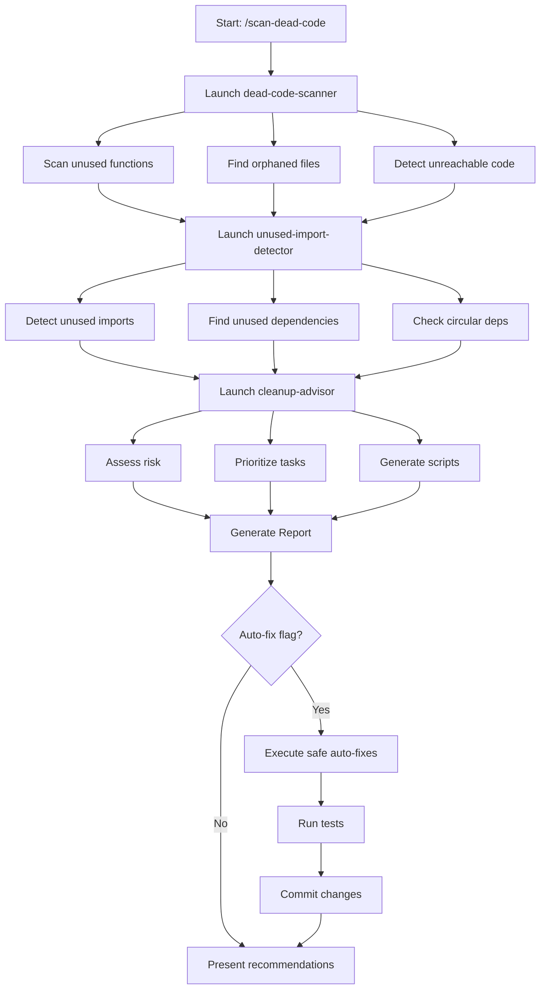

# Scan Dead Code

Perform a comprehensive dead code analysis including unused functions, unreachable code, orphaned files, unused imports, and dead dependencies. Generates actionable cleanup recommendations with risk assessment.

## Usage

```
/scan-dead-code [--focus=imports|functions|files] [--auto-fix] [--output=report]
```

**Examples:**
```
/scan-dead-code                           # Full analysis
/scan-dead-code --focus=imports           # Focus on unused imports only
/scan-dead-code --focus=files             # Focus on orphaned files only
/scan-dead-code --auto-fix                # Auto-fix safe issues (imports)
/scan-dead-code --output=docs/cleanup     # Custom output directory
```

## Execution Flow

This command orchestrates multiple specialized agents to perform comprehensive dead code detection and provide safe removal recommendations.

### Phase 1: Dead Code Detection (dead-code-scanner)

**Agent**: `dead-code-scanner`

**Tasks:**
1. Scan for unused functions and variables
2. Find unreachable code paths
3. Identify obsolete exports
4. Locate dead conditional branches
5. Discover orphaned files
6. Detect commented-out code blocks

**Tools Used:**
- `ts-prune` - Find unused TypeScript/JavaScript exports
- `ts-unused-exports` - Detailed TS export analysis
- `knip` - Comprehensive project linting
- `unimported` - Fast orphaned file detection
- ESLint `no-unused-vars` - Variable detection
- Custom AST parsing for unreachable code

**Output:**
```typescript
{
  unusedFunctions: [
    {
      file: "src/utils/legacy.ts",
      line: 45,
      name: "oldCalculation",
      references: 0,
      lastModified: "2023-05-10"
    }
  ],
  orphanedFiles: [
    {
      path: "src/auth/old-auth.ts",
      lines: 234,
      lastModified: "2023-08-15",
      references: 0
    }
  ],
  unreachableCode: [...],
  deadBranches: [...],
  commentedCode: [...]
}
```

### Phase 2: Import Analysis (unused-import-detector)

**Agent**: `unused-import-detector`

**Tasks:**
1. Detect unused imports in all files
2. Find redundant imports (duplicates from same module)
3. Identify type-only import opportunities
4. Detect circular dependencies
5. Analyze barrel file inefficiencies
6. Find unused dependencies in package.json

**Tools Used:**
- ESLint `no-unused-vars`
- TypeScript compiler (`noUnusedLocals`, `noUnusedParameters`)
- `depcheck` - Find unused dependencies
- `madge` - Circular dependency detection

**Output:**
```typescript
{
  unusedImports: [
    {
      file: "src/components/Dashboard.tsx",
      line: 3,
      import: "useEffect",
      from: "react",
      autoFixable: true
    }
  ],
  unusedDependencies: [
    {
      name: "lodash",
      size: "70KB",
      lastUsed: "never",
      inPackageJson: "dependencies"
    }
  ],
  circularDependencies: [
    {
      cycle: ["user.service.ts", "auth.service.ts", "user.service.ts"],
      severity: "high"
    }
  ]
}
```

### Phase 3: Cleanup Recommendations (cleanup-advisor)

**Agent**: `cleanup-advisor`

**Tasks:**
1. Assess removal risk for each finding (low/medium/high)
2. Prioritize cleanup tasks by impact vs effort
3. Generate safe removal scripts
4. Create rollback strategy
5. Estimate time and impact
6. Provide step-by-step cleanup plan

**Risk Assessment:**
- 🟢 **Low Risk**: Private functions, orphaned files, unused imports
- 🟡 **Medium Risk**: Exported functions, utility modules
- 🔴 **High Risk**: API endpoints, library exports, dynamic imports

**Output:**
```typescript
{
  quickWins: [
    {
      task: "Auto-fix unused imports",
      files: 118,
      lines: 118,
      effort: "5 minutes",
      risk: "low",
      command: "npx eslint src/ --fix"
    }
  ],
  mediumPriority: [...],
  highRisk: [...],
  estimatedSavings: {
    totalLines: 2150,
    percentageReduction: 17.3,
    bundleSizeReduction: "50KB",
    filesRemoved: 12
  }
}
```

## Execution Workflow



## Report Structure

### Executive Summary

```markdown
# Dead Code Analysis Report

**Project**: MyApp
**Files Analyzed**: 247 files (12,450 lines)
**Analysis Date**: 2025-10-17
**Scan Duration**: 2 minutes 34 seconds

## Overall Status: 🟡 Moderate Cleanup Needed

### Key Metrics
- **Dead Code Found**: 1,847 lines (14.8%)
- **Orphaned Files**: 12 files (1,245 lines)
- **Unused Imports**: 127 instances
- **Unused Dependencies**: 5 packages (372KB)
- **Circular Dependencies**: 2 critical
- **Unreachable Code**: 8 blocks (67 lines)

### Potential Savings
- **Lines**: 2,150 lines (17.3% reduction)
- **Files**: 12 files removed
- **Bundle Size**: 50KB reduction
- **Build Time**: ~10% faster
- **Maintainability**: Significantly improved
```

### Quick Wins Section

```markdown
## Quick Wins (4 hours total)

### 1. Auto-Fix Unused Imports
**Impact**: 🟢 High | **Risk**: 🟢 Low | **Effort**: 5 minutes

**Command**:
```bash
npx eslint src/ --fix
```

**Expected Outcome**:
- 118 imports removed
- 118 lines saved
- Zero risk of breakage
- Fully automated

### 2. Remove Orphaned Files
**Impact**: 🟢 High | **Risk**: 🟢 Low | **Effort**: 1 hour

**Files** (12 total):
- `src/auth/old-auth.ts` (234 lines) - Last modified 15 months ago
- `src/auth/legacy-tokens.ts` (156 lines) - Replaced with new system
- `src/components/OldButton.tsx` (67 lines) - New Button component exists
- [9 more files...]

**Verification**:
```bash
# Confirm zero references
for file in $(cat orphaned-files.txt); do
  grep -r "$(basename $file .ts)" src/ && echo "⚠️ Found reference!"
done
```

**Expected Outcome**:
- 1,245 lines removed
- 12 files deleted
- Cleaner file structure
- Reduced cognitive load

### 3. Clean Dead Variables
**Impact**: 🟡 Medium | **Risk**: 🟢 Low | **Effort**: 2 hours

**Instances**: 43 unused local variables

**Example**:
```typescript
// Before
function processOrder(order: Order) {
  const timestamp = Date.now(); // UNUSED
  const orderId = order.orderId; // UNUSED
  return stripe.charge(order);
}

// After
function processOrder(order: Order) {
  return stripe.charge(order);
}
```

**Expected Outcome**:
- 43 lines removed
- Improved code clarity
- Reduced confusion
```

### Detailed Findings

```markdown
## Detailed Analysis

### Orphaned Files (12 files, 1,245 lines)

#### 1. Legacy Authentication Module (479 lines)
**Risk**: 🟢 Low - Safe to remove

**Files**:
- `src/auth/old-auth.ts` (234 lines)
- `src/auth/legacy-tokens.ts` (156 lines)
- `src/auth/deprecated-validators.ts` (89 lines)

**Analysis**:
- Last modified: 2023-08-15 (15 months ago)
- Git blame: @john.doe - "Replaced with new auth system"
- References: 0 found in codebase
- Imports: None

**Replacement**: New auth system in `src/auth/v2/`

**Removal Command**:
```bash
git rm src/auth/old-auth.ts src/auth/legacy-tokens.ts src/auth/deprecated-validators.ts
git commit -m "Remove legacy auth module (replaced by v2)"
```

**Time**: 15 minutes
**Impact**: 479 lines saved

#### 2. Unused Components (190 lines)
**Risk**: 🟢 Low - Safe to remove

**Files**:
- `src/components/OldButton.tsx` (67 lines)
- `src/components/LegacyModal.tsx` (123 lines)

**Analysis**:
- Replaced by: `src/components/Button.tsx`, `src/components/Modal.tsx`
- Last used: > 1 year ago
- References: 0

**Action**: Delete and update component documentation

### Unused Exports (34 exports)

#### High Priority (15 exports)

**src/utils/helpers.ts**

| Function | Line | References | Risk | Action |
|----------|------|------------|------|--------|
| `formatCurrency` | 45 | 0 | 🟡 Medium | Convert to internal or delete |
| `parseQuery` | 67 | 0 | 🟡 Medium | Convert to internal or delete |
| `deepClone` | 89 | 0 | 🟡 Medium | Delete (use structuredClone) |

**Recommendation**:
```typescript
// If used internally, remove export:
function formatCurrency(amount: number) { }

// If never used, delete entirely
```

**Risk Assessment**:
- May be part of public API if this is a library
- Check if exported in package.json
- Review if documented externally

### Unreachable Code (8 instances, 67 lines)

#### src/services/order.ts:145

```typescript
function processOrder(order: Order) {
  if (!order) return null;

  const result = calculateTotal(order);
  return result;

  // UNREACHABLE CODE (lines 150-152)
  console.log('Order processed');
  notifyUser(order.userId);
  updateAnalytics();
}
```

**Fix**: Remove lines 150-152
**Risk**: 🟢 Low
**Time**: 5 minutes

### Circular Dependencies (2 found)

#### Critical: User Service Cycle

```
src/services/user.service.ts
  ↓ imports fetchUser
src/services/auth.service.ts
  ↓ imports validateUser
src/services/user.service.ts
```

**Impact**: 🔴 High - Can cause initialization issues

**Fix Strategy**:
1. Extract shared logic to `src/services/shared/validation.ts`
2. Update both services to import from shared module
3. Remove circular reference

**Example**:
```typescript
// Create: src/services/shared/user-validation.ts
export function validateUser(user: User) {
  // Shared validation logic
}

// Update: src/services/user.service.ts
import { validateUser } from './shared/user-validation';

// Update: src/services/auth.service.ts
import { validateUser } from './shared/user-validation';
```

**Time**: 30 minutes
**Risk**: 🟡 Medium
**Priority**: 🔴 Critical

### Unused Dependencies (5 packages, 372KB)

| Package | Size | Last Used | Type | Risk |
|---------|------|-----------|------|------|
| lodash | 70KB | Never | dependency | 🟢 Low |
| moment | 289KB | Never | dependency | 🟢 Low |
| axios | 13KB | Never | dependency | 🟡 Medium |
| @types/lodash | - | Never | devDependency | 🟢 Low |
| eslint-plugin-old | - | Never | devDependency | 🟢 Low |

**Removal Command**:
```bash
npm uninstall lodash moment axios @types/lodash eslint-plugin-old
```

**Savings**: 372KB bundle size reduction
**Time**: 5 minutes
**Risk**: 🟢 Low (verify no dynamic requires first)

**Verification**:
```bash
# Check for dynamic requires
grep -r "require('lodash')" src/
grep -r "require('moment')" src/
```
```

### Cleanup Action Plan

```markdown
## Cleanup Action Plan

### Sprint 1: Quick Wins (4 hours)

#### Day 1: Automated Fixes (1 hour)

**Task 1.1**: Auto-fix unused imports (5 min)
```bash
npx eslint src/ --fix
npm test
git commit -am "Remove unused imports (auto-fixed)"
```

**Task 1.2**: Run dead code report (5 min)
```bash
./scripts/dead-code-report.sh
```

**Task 1.3**: Remove commented code (10 min)
```bash
node scripts/remove-commented-code.js
npm test
git commit -am "Remove commented code blocks"
```

#### Day 2: Orphaned Files (1 hour)

**Task 2.1**: Review orphaned file list (15 min)
- Verify zero references
- Check git history
- Confirm replacements exist

**Task 2.2**: Delete orphaned files (30 min)
```bash
# Run removal script
./scripts/remove-orphaned-files.sh

# Verify tests pass
npm test

# Commit
git commit -am "Remove orphaned files (12 files, 1,245 lines)"
```

#### Day 3: Clean Variables (2 hours)

**Task 3.1**: ESLint unused var check
```bash
npx eslint src/ --rule "no-unused-vars: error"
```

**Task 3.2**: Manual cleanup (43 instances)
- Review each unused variable
- Verify safe to remove
- Delete and test

### Sprint 2: Medium Priority (8 hours)

#### Week 2, Day 1: Circular Dependencies (4 hours)

**Task**: Fix 2 circular dependency cycles
- Extract shared modules
- Update imports
- Run comprehensive tests

#### Week 2, Day 2: Export Optimization (2 hours)

**Task**: Review 15 unused exports
- Determine if public API
- Convert to internal or delete
- Update documentation

#### Week 2, Day 3: Barrel Files (2 hours)

**Task**: Optimize import efficiency
- Review barrel file usage
- Direct imports where needed
- Measure bundle size impact

### Sprint 3: High Risk (Deferred)

**Task**: API deprecation (requires major version)
- Add deprecation warnings
- Update documentation
- Plan breaking change release

## Success Criteria

- [ ] All tests pass (100%)
- [ ] No new ESLint errors
- [ ] Build succeeds without warnings
- [ ] Code review approved by 2 reviewers
- [ ] Documentation updated
- [ ] Team notified of changes

## Rollback Plan

**If issues arise:**

```bash
# Revert last commit
git revert HEAD

# Or full branch rollback
git checkout main
git branch -D cleanup/dead-code-removal

# Restore from backup branch
git checkout backup/before-cleanup
```

**Testing After Rollback:**
```bash
npm test
npm run build
npm run lint
```

## Metrics Dashboard

### Before vs After

| Metric | Before | After | Change |
|--------|--------|-------|--------|
| Total Lines | 12,450 | 10,300 | -2,150 (-17.3%) |
| Files | 247 | 235 | -12 (-4.9%) |
| Dead Code % | 14.8% | <3% | -11.8% |
| Unused Imports | 127 | 0 | -127 (-100%) |
| Orphaned Files | 12 | 0 | -12 (-100%) |
| Circular Deps | 2 | 0 | -2 (-100%) |
| Bundle Size | 850KB | 800KB | -50KB (-5.9%) |
| Build Time | 45s | 40s | -5s (-11%) |

### ROI Calculation

**Time Invested**: 12 hours (1.5 developer days)

**Savings**:
- **Build time**: 5s per build × 50 builds/day = 250s/day = 4.2 min/day
- **Cognitive load**: Easier navigation, less confusion
- **Maintenance**: Fewer files to maintain
- **Onboarding**: Clearer codebase for new developers
- **Bug risk**: Less code = fewer potential bugs

**Payback Period**: ~2 weeks of development

## Continuous Monitoring

### Pre-commit Hook
```bash
# .husky/pre-commit
npx eslint --fix "$(git diff --cached --name-only | grep -E '\.(ts|tsx)$')"
```

### CI/CD Gate
```yaml
# .github/workflows/dead-code-check.yml
- name: Dead Code Check
  run: |
    npx ts-prune | grep -v "used in module"
    if [ $? -eq 0 ]; then
      echo "Dead code detected"
      exit 1
    fi
```

### Monthly Report
```bash
# Scheduled job
0 0 1 * * /path/to/scripts/dead-code-report.sh
```
```

## Options Reference

### --focus
Narrow analysis to specific area:
- `imports` - Only unused imports
- `functions` - Only unused functions/variables
- `files` - Only orphaned files
- `dependencies` - Only package.json deps

### --auto-fix
Automatically fix safe issues (unused imports):
```bash
/scan-dead-code --auto-fix
```

Equivalent to:
```bash
npx eslint src/ --fix
npm test
git commit -am "Auto-fix unused imports"
```

### --output
Specify custom report directory:
```bash
/scan-dead-code --output=docs/cleanup
```

Creates:
- `docs/cleanup/report.md` - Main report
- `docs/cleanup/scripts/` - Cleanup scripts
- `docs/cleanup/data/` - JSON data files

## Best Practices

1. **Run Before Major Releases**
   - Clean codebase before v2.0
   - Reduce technical debt
   - Improve code quality metrics

2. **Quarterly Cleanup Sprints**
   - Schedule dedicated time
   - Team-wide participation
   - Celebrate wins

3. **Continuous Monitoring**
   - Pre-commit hooks
   - CI/CD gates
   - Monthly reports

4. **Safe Removal Process**
   - Always backup first
   - Test thoroughly
   - Incremental changes
   - Easy rollback

5. **Team Communication**
   - Share findings
   - Discuss priorities
   - Coordinate efforts
   - Document decisions

This command helps maintain a clean, efficient codebase free of dead code, improving maintainability, reducing bundle size, and enhancing developer productivity.
