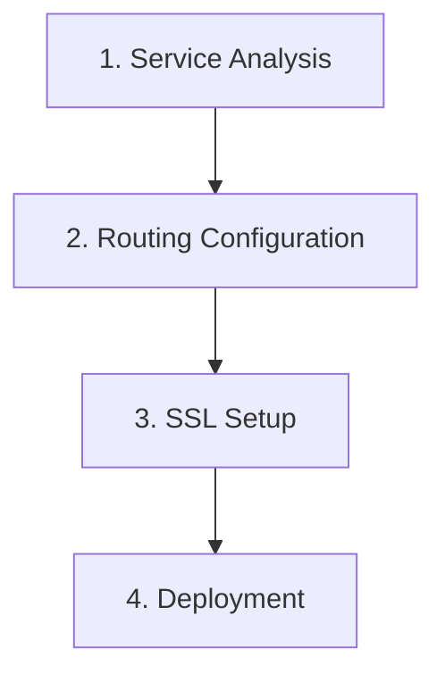

# Configure Nginx

Configure nginx as a reverse proxy for Docker Compose environments with flexible routing, SSL/TLS, load balancing, and security best practices.

## Usage

```bash
/configure-nginx [--routing=path|subdomain] [--ssl=self|letsencrypt|none] [--load-balance]
```

**Examples:**
```bash
/configure-nginx
/configure-nginx --routing=path --ssl=self
/configure-nginx --routing=subdomain --ssl=letsencrypt
/configure-nginx --load-balance --ssl=letsencrypt
```

## Workflow Overview

The nginx configuration workflow consists of 4 key phases:



## Phase 1: Service Analysis

**Objective**: Understand services that need routing.

### Actions
1. **Analyze docker-compose.yml**:
   - Identify services with exposed ports
   - Determine service dependencies
   - Find health check endpoints
   - Note WebSocket requirements

2. **Gather routing requirements**:
   - Which services need external access?
   - What URL patterns should be used?
   - Are subdomains needed?
   - Is load balancing required?

### Questions to Ask
```markdown
## Nginx Configuration Questions

I'll configure nginx as your reverse proxy. Let me clarify:

1. **Routing Strategy**:
   - [ ] Path-based: `/` → frontend, `/api` → backend
   - [ ] Subdomain-based: `www.` → frontend, `api.` → backend

2. **Services to Route**:
   - [ ] Frontend (which port?)
   - [ ] Backend API (which port?)
   - [ ] Admin panel (which port?)
   - [ ] Other services

3. **SSL/TLS**:
   - [ ] Self-signed certificate (development)
   - [ ] Let's Encrypt (production)
   - [ ] No SSL (development only)

4. **Special Requirements**:
   - [ ] WebSocket support
   - [ ] Load balancing (multiple instances)
   - [ ] Rate limiting
   - [ ] CORS headers
   - [ ] Static file serving
   - [ ] Caching

5. **Domain Names** (if using SSL):
   - Primary domain: _____________
   - Additional domains: _____________
```

## Phase 2: Routing Configuration

**Objective**: Generate nginx configuration using nginx-configurator agent.

### Actions
1. **Launch nginx-configurator agent** to:
   - Generate main nginx.conf
   - Create server blocks
   - Configure routing rules
   - Add security headers
   - Set up caching (if requested)

2. **Routing patterns:**

### Path-Based Routing

**URL structure:**
- `http://localhost/` → Frontend
- `http://localhost/api` → Backend API
- `http://localhost/admin` → Admin panel
- `http://localhost/ws` → WebSocket

**Generated configuration:**
```nginx
# nginx/conf.d/default.conf
upstream frontend {
    server frontend:3000;
}

upstream backend {
    server backend:4000;
}

server {
    listen 80;
    server_name localhost;

    # Frontend
    location / {
        proxy_pass http://frontend;
        proxy_set_header Host $host;
        proxy_set_header X-Real-IP $remote_addr;
        proxy_set_header X-Forwarded-For $proxy_add_x_forwarded_for;
        proxy_set_header X-Forwarded-Proto $scheme;
    }

    # Backend API
    location /api {
        proxy_pass http://backend;
        proxy_set_header Host $host;
        proxy_set_header X-Real-IP $remote_addr;
        proxy_set_header X-Forwarded-For $proxy_add_x_forwarded_for;
        proxy_set_header X-Forwarded-Proto $scheme;
    }

    # WebSocket
    location /ws {
        proxy_pass http://backend;
        proxy_http_version 1.1;
        proxy_set_header Upgrade $http_upgrade;
        proxy_set_header Connection "upgrade";
        proxy_set_header Host $host;
    }
}
```

### Subdomain-Based Routing

**URL structure:**
- `http://www.example.com` → Frontend
- `http://api.example.com` → Backend API
- `http://admin.example.com` → Admin panel

**Generated configuration:**
```nginx
# nginx/conf.d/subdomains.conf

# Frontend
server {
    listen 80;
    server_name www.example.com example.com;

    location / {
        proxy_pass http://frontend:3000;
        proxy_set_header Host $host;
        proxy_set_header X-Real-IP $remote_addr;
    }
}

# Backend API
server {
    listen 80;
    server_name api.example.com;

    location / {
        proxy_pass http://backend:4000;
        proxy_set_header Host $host;
        proxy_set_header X-Real-IP $remote_addr;
    }
}

# Admin Panel
server {
    listen 80;
    server_name admin.example.com;

    # IP whitelist
    allow 192.168.1.0/24;
    deny all;

    location / {
        proxy_pass http://admin:5000;
        proxy_set_header Host $host;
        proxy_set_header X-Real-IP $remote_addr;
    }
}
```

### Load Balancing

**Multiple backend instances:**
```nginx
upstream backend_cluster {
    least_conn;  # Load balancing algorithm
    server backend-1:4000 weight=3;
    server backend-2:4000 weight=2;
    server backend-3:4000 weight=1;
    keepalive 32;
}

server {
    listen 80;
    server_name api.example.com;

    location / {
        proxy_pass http://backend_cluster;
        proxy_http_version 1.1;
        proxy_set_header Connection "";
        proxy_set_header Host $host;
    }
}
```

## Phase 3: SSL Setup

**Objective**: Configure SSL/TLS certificates.

### Self-Signed Certificate (Development)

**Actions:**
1. Generate certificate:
```bash
#!/bin/bash
# nginx/ssl/generate-cert.sh
mkdir -p nginx/ssl

openssl req -x509 -nodes -days 365 -newkey rsa:2048 \
  -keyout nginx/ssl/key.pem \
  -out nginx/ssl/cert.pem \
  -subj "/C=US/ST=State/L=City/O=Org/CN=localhost"
```

2. Update nginx configuration:
```nginx
server {
    listen 443 ssl http2;
    server_name localhost;

    ssl_certificate /etc/nginx/ssl/cert.pem;
    ssl_certificate_key /etc/nginx/ssl/key.pem;
    ssl_protocols TLSv1.2 TLSv1.3;
    ssl_ciphers HIGH:!aNULL:!MD5;

    location / {
        proxy_pass http://frontend:3000;
    }
}

# Redirect HTTP to HTTPS
server {
    listen 80;
    server_name localhost;
    return 301 https://$server_name$request_uri;
}
```

### Let's Encrypt Certificate (Production)

**Actions:**
1. Add certbot to docker-compose.yml:
```yaml
services:
  certbot:
    image: certbot/certbot
    container_name: certbot
    volumes:
      - ./nginx/ssl:/etc/letsencrypt
      - ./nginx/certbot-webroot:/var/www/certbot
    entrypoint: "/bin/sh -c 'trap exit TERM; while :; do certbot renew; sleep 12h & wait $${!}; done;'"
```

2. Create init script:
```bash
#!/bin/bash
# scripts/init-letsencrypt.sh

# Get initial certificate
docker-compose run --rm certbot certonly \
  --webroot \
  --webroot-path=/var/www/certbot \
  --email admin@example.com \
  --agree-tos \
  --no-eff-email \
  -d example.com \
  -d www.example.com
```

3. Update nginx configuration:
```nginx
# HTTP server for ACME challenge
server {
    listen 80;
    server_name example.com www.example.com;

    location /.well-known/acme-challenge/ {
        root /var/www/certbot;
    }

    location / {
        return 301 https://$server_name$request_uri;
    }
}

# HTTPS server
server {
    listen 443 ssl http2;
    server_name example.com www.example.com;

    ssl_certificate /etc/nginx/ssl/live/example.com/fullchain.pem;
    ssl_certificate_key /etc/nginx/ssl/live/example.com/privkey.pem;
    ssl_protocols TLSv1.2 TLSv1.3;

    location / {
        proxy_pass http://frontend:3000;
    }
}
```

## Phase 4: Deployment

**Objective**: Apply nginx configuration and verify.

### Actions
1. **Update docker-compose.yml** to include nginx volumes:
```yaml
services:
  nginx:
    image: nginx:alpine
    container_name: myapp-nginx
    ports:
      - "80:80"
      - "443:443"
    volumes:
      - ./nginx/nginx.conf:/etc/nginx/nginx.conf:ro
      - ./nginx/conf.d:/etc/nginx/conf.d:ro
      - ./nginx/ssl:/etc/nginx/ssl:ro
      - ./nginx/certbot-webroot:/var/www/certbot:ro
    depends_on:
      - frontend
      - backend
    networks:
      - frontend
    restart: unless-stopped
```

2. **Test configuration:**
```bash
# Test nginx config syntax
docker-compose exec nginx nginx -t

# Reload nginx
docker-compose exec nginx nginx -s reload
```

3. **Restart nginx:**
```bash
docker-compose restart nginx
```

4. **Verify routing:**
```bash
# Test frontend
curl -I http://localhost/

# Test backend API
curl -I http://localhost/api

# Test HTTPS (if enabled)
curl -I https://localhost/
```

## Configuration Options

### Security Headers

```nginx
server {
    # HSTS
    add_header Strict-Transport-Security "max-age=31536000; includeSubDomains" always;

    # Prevent clickjacking
    add_header X-Frame-Options "SAMEORIGIN" always;

    # Prevent MIME sniffing
    add_header X-Content-Type-Options "nosniff" always;

    # XSS Protection
    add_header X-XSS-Protection "1; mode=block" always;

    # Referrer Policy
    add_header Referrer-Policy "strict-origin-when-cross-origin" always;

    # CSP
    add_header Content-Security-Policy "default-src 'self'; script-src 'self' 'unsafe-inline';" always;

    # Hide nginx version
    server_tokens off;
}
```

### Rate Limiting

```nginx
# In nginx.conf http block
http {
    limit_req_zone $binary_remote_addr zone=api_limit:10m rate=20r/s;
    limit_req_zone $binary_remote_addr zone=login_limit:10m rate=5r/m;
}

# In server block
server {
    location /api {
        limit_req zone=api_limit burst=50 nodelay;
        proxy_pass http://backend;
    }

    location /api/auth/login {
        limit_req zone=login_limit burst=5 nodelay;
        proxy_pass http://backend;
    }
}
```

### CORS Headers

```nginx
location /api {
    # CORS headers
    add_header 'Access-Control-Allow-Origin' '*' always;
    add_header 'Access-Control-Allow-Methods' 'GET, POST, PUT, DELETE, OPTIONS' always;
    add_header 'Access-Control-Allow-Headers' 'Authorization, Content-Type' always;

    # Handle preflight
    if ($request_method = 'OPTIONS') {
        return 204;
    }

    proxy_pass http://backend;
}
```

### Caching

```nginx
# Cache configuration
proxy_cache_path /var/cache/nginx levels=1:2 keys_zone=api_cache:10m max_size=1g;

server {
    location /api/public {
        proxy_cache api_cache;
        proxy_cache_valid 200 10m;
        proxy_cache_use_stale error timeout updating;
        add_header X-Cache-Status $upstream_cache_status;

        proxy_pass http://backend;
    }
}
```

## Output Format

Provide comprehensive nginx configuration report:

```markdown
## Nginx Configuration Complete

### Configuration Summary
**Routing Type**: Path-based
**SSL**: Self-signed (development)
**Load Balancing**: Disabled
**Rate Limiting**: Enabled

### Routing Rules

#### Path-Based Routing
- `/` → frontend:3000 (React SPA)
- `/api/*` → backend:4000 (REST API)
- `/ws` → backend:4000 (WebSocket)
- `/admin` → admin:5000 (Admin Panel)

### SSL Configuration
**Type**: Self-signed certificate
**Protocols**: TLSv1.2, TLSv1.3
**HTTPS Port**: 443
**HTTP Redirect**: Enabled (all HTTP → HTTPS)

### Security Features
- ✅ Security headers (HSTS, X-Frame-Options, CSP)
- ✅ Rate limiting (20 req/s API, 5 req/m login)
- ✅ Hidden server tokens
- ✅ IP whitelist for admin panel

### Performance Features
- ✅ Gzip compression
- ✅ HTTP/2 support
- ✅ Keepalive connections
- ✅ Proxy caching (10min for public API)

### Files Created
- ✅ nginx/nginx.conf
- ✅ nginx/conf.d/default.conf
- ✅ nginx/ssl/cert.pem
- ✅ nginx/ssl/key.pem

### Access URLs
- **Frontend**: http://localhost → https://localhost
- **Backend API**: http://localhost/api
- **Admin Panel**: http://localhost/admin (IP restricted)
- **Health Check**: http://localhost/health

### Testing Commands

\`\`\`bash
# Test configuration
docker-compose exec nginx nginx -t

# Reload nginx
docker-compose exec nginx nginx -s reload

# View logs
docker-compose logs -f nginx

# Test endpoints
curl -I https://localhost/
curl -I https://localhost/api
curl https://localhost/api/health
\`\`\`

### Next Steps
1. For production: Replace self-signed cert with Let's Encrypt
2. Configure monitoring for nginx metrics
3. Set up log aggregation
4. Fine-tune rate limits based on traffic
5. Add custom error pages

### Troubleshooting

**Issue**: "502 Bad Gateway"
**Solution**: Check if backend services are running: `docker-compose ps`

**Issue**: "Certificate not trusted"
**Solution**: Expected with self-signed cert in development

**Issue**: "Connection refused"
**Solution**: Verify services are on the same network
```

This command creates a complete, production-ready nginx reverse proxy configuration for your Docker Compose environment.
