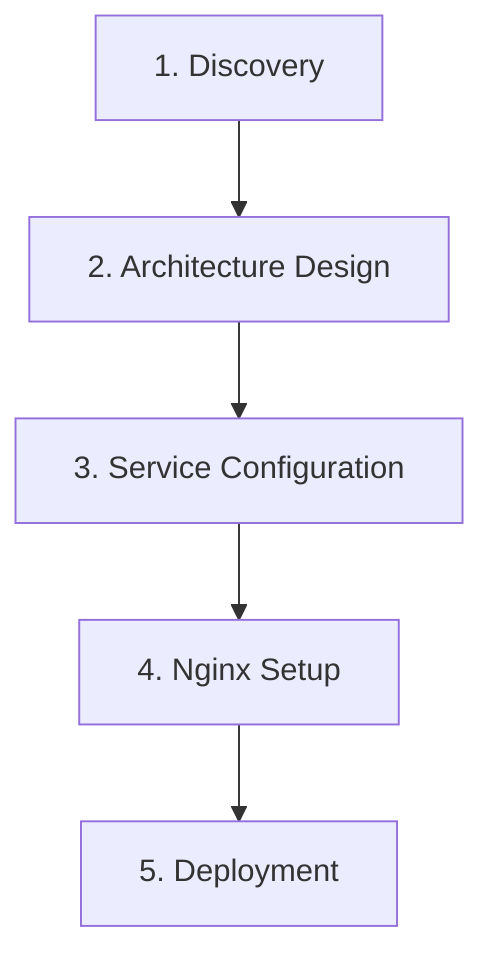

# Setup Docker Environment

Create a complete production-ready Docker Compose environment with nginx reverse proxy routing for multi-service applications.

## Usage

```bash
/setup-docker-env [project-name] [--type=fullstack|microservices|simple]
```

**Examples:**
```bash
/setup-docker-env my-app
/setup-docker-env my-api --type=microservices
/setup-docker-env blog --type=simple
```

## Workflow Overview

The Docker environment setup workflow consists of 5 key phases:



## Phase 1: Discovery

**Objective**: Understand project requirements and service needs.

### Actions
1. **Create todo list** for tracking progress
2. **Analyze project structure**:
   - Identify application type (web app, API, microservices)
   - Detect existing Dockerfiles
   - Find package managers (package.json, requirements.txt, etc.)
   - Check for databases or caching needs

3. **Gather requirements**:
   - What services are needed?
   - What are the dependencies?
   - What ports should be exposed?
   - What environment variables are required?

### Questions to Ask
```markdown
## Environment Setup Questions

I'll set up your Docker Compose environment. Let me clarify a few things:

1. **Application Type**:
   - [ ] Full-stack (frontend + backend + database)
   - [ ] Microservices (multiple APIs)
   - [ ] Simple (single service + database)

2. **Services Needed**:
   - [ ] Frontend (React/Vue/Angular)
   - [ ] Backend API (Node.js/Python/Go)
   - [ ] Database (PostgreSQL/MySQL/MongoDB)
   - [ ] Cache (Redis/Memcached)
   - [ ] Message Queue (RabbitMQ/Kafka)
   - [ ] Admin tools

3. **Routing**:
   - [ ] Path-based (/ for frontend, /api for backend)
   - [ ] Subdomain-based (www. for frontend, api. for backend)

4. **SSL**:
   - [ ] Self-signed (development)
   - [ ] Let's Encrypt (production)
   - [ ] No SSL

5. **Environment**:
   - [ ] Development (hot reload, debug mode)
   - [ ] Production (optimized, secure)
```

### Todo List Example
```markdown
- [ ] Analyze project structure
- [ ] Design service architecture
- [ ] Create docker-compose.yml
- [ ] Configure environment variables
- [ ] Set up nginx reverse proxy
- [ ] Deploy services with Docker MCP
- [ ] Verify deployment
- [ ] Generate documentation
```

## Phase 2: Architecture Design

**Objective**: Design optimal container architecture using container-orchestrator agent.

### Actions
1. **Launch container-orchestrator agent** to:
   - Analyze project structure
   - Design multi-service architecture
   - Determine service dependencies
   - Plan network configuration
   - Design volume strategy

2. **Agent will create**:
   - Complete docker-compose.yml
   - Service dependency graph
   - Network architecture diagram
   - Volume mapping plan

3. **Review architecture**:
   - Service isolation strategy
   - Network segmentation
   - Data persistence approach
   - Health check configuration

### Expected Output
```markdown
## Architecture Design

### Services (5)
1. **Frontend** (React) - Port 3000
2. **Backend** (Node.js) - Port 4000
3. **PostgreSQL** - Port 5432
4. **Redis** - Port 6379
5. **Nginx** - Ports 80/443

### Networks
- **frontend**: nginx, frontend, backend
- **backend** (internal): backend, postgres, redis

### Volumes
- **postgres-data**: Database persistence
- **redis-data**: Cache persistence
- **uploads**: User uploaded files

### Dependencies
- Backend depends on postgres, redis
- Frontend depends on backend
- Nginx depends on frontend, backend
```

## Phase 3: Service Configuration

**Objective**: Create comprehensive service configurations.

### Actions
1. **Create docker-compose.yml** with:
   - All service definitions
   - Proper dependency management
   - Health checks
   - Resource limits
   - Logging configuration
   - Restart policies

2. **Create .env file** with:
   - Database credentials
   - API keys
   - Service ports
   - Configuration variables

3. **Create .env.example**:
   - Template with all variables
   - No sensitive values
   - Comments explaining each variable

4. **Create Dockerfiles** if needed:
   - Multi-stage builds for optimization
   - Security best practices
   - Minimal base images

### Service Configuration Template

```yaml
version: '3.8'

services:
  frontend:
    build:
      context: ./frontend
      dockerfile: Dockerfile
    container_name: ${PROJECT_NAME}-frontend
    expose:
      - "3000"
    environment:
      - NODE_ENV=${NODE_ENV}
      - VITE_API_URL=${API_URL}
    volumes:
      - ./frontend:/app
      - /app/node_modules
    depends_on:
      - backend
    networks:
      - frontend
    restart: unless-stopped
    healthcheck:
      test: ["CMD", "wget", "--quiet", "--tries=1", "--spider", "http://localhost:3000"]
      interval: 30s
      timeout: 10s
      retries: 3

  backend:
    build:
      context: ./backend
      dockerfile: Dockerfile
    container_name: ${PROJECT_NAME}-backend
    expose:
      - "4000"
    environment:
      - NODE_ENV=${NODE_ENV}
      - DATABASE_URL=${DATABASE_URL}
      - REDIS_URL=redis://redis:6379
    volumes:
      - ./backend:/app
      - /app/node_modules
      - uploads:/app/uploads
    depends_on:
      postgres:
        condition: service_healthy
      redis:
        condition: service_healthy
    networks:
      - frontend
      - backend
    restart: unless-stopped
    healthcheck:
      test: ["CMD", "wget", "--quiet", "--tries=1", "--spider", "http://localhost:4000/health"]
      interval: 30s
      timeout: 10s
      retries: 3

  postgres:
    image: postgres:15-alpine
    container_name: ${PROJECT_NAME}-postgres
    expose:
      - "5432"
    environment:
      - POSTGRES_USER=${DB_USER}
      - POSTGRES_PASSWORD=${DB_PASSWORD}
      - POSTGRES_DB=${DB_NAME}
    volumes:
      - postgres-data:/var/lib/postgresql/data
    networks:
      - backend
    restart: unless-stopped
    healthcheck:
      test: ["CMD-SHELL", "pg_isready -U ${DB_USER}"]
      interval: 10s
      timeout: 5s
      retries: 5

  redis:
    image: redis:7-alpine
    container_name: ${PROJECT_NAME}-redis
    expose:
      - "6379"
    volumes:
      - redis-data:/data
    networks:
      - backend
    restart: unless-stopped
    command: redis-server --appendonly yes
    healthcheck:
      test: ["CMD", "redis-cli", "ping"]
      interval: 10s
      timeout: 3s
      retries: 5

  nginx:
    image: nginx:alpine
    container_name: ${PROJECT_NAME}-nginx
    ports:
      - "${HTTP_PORT:-80}:80"
      - "${HTTPS_PORT:-443}:443"
    volumes:
      - ./nginx/nginx.conf:/etc/nginx/nginx.conf:ro
      - ./nginx/conf.d:/etc/nginx/conf.d:ro
      - ./nginx/ssl:/etc/nginx/ssl:ro
    depends_on:
      - frontend
      - backend
    networks:
      - frontend
    restart: unless-stopped
    healthcheck:
      test: ["CMD", "wget", "--quiet", "--tries=1", "--spider", "http://localhost/health"]
      interval: 30s
      timeout: 10s
      retries: 3

networks:
  frontend:
    driver: bridge
  backend:
    driver: bridge
    internal: true

volumes:
  postgres-data:
  redis-data:
  uploads:
```

## Phase 4: Nginx Setup

**Objective**: Configure nginx reverse proxy using nginx-configurator agent.

### Actions
1. **Launch nginx-configurator agent** to:
   - Generate nginx.conf
   - Create server blocks
   - Configure routing rules
   - Set up SSL certificates
   - Add security headers
   - Configure caching

2. **Agent will create**:
   - nginx/nginx.conf (main configuration)
   - nginx/conf.d/default.conf (server blocks)
   - nginx/ssl/cert.pem (SSL certificate)
   - nginx/ssl/key.pem (private key)

3. **Routing configuration**:
   - Path-based routing (/ → frontend, /api → backend)
   - OR subdomain routing (www., api.)
   - WebSocket support if needed
   - Static file serving

### Nginx Configuration Output

```nginx
# Path-based routing
server {
    listen 443 ssl http2;
    server_name example.com;

    # Frontend
    location / {
        proxy_pass http://frontend:3000;
        proxy_set_header Host $host;
        proxy_set_header X-Real-IP $remote_addr;
    }

    # Backend API
    location /api {
        proxy_pass http://backend:4000;
        proxy_set_header Host $host;
        proxy_set_header X-Real-IP $remote_addr;
    }

    # WebSocket
    location /ws {
        proxy_pass http://backend:4000;
        proxy_http_version 1.1;
        proxy_set_header Upgrade $http_upgrade;
        proxy_set_header Connection "upgrade";
    }
}
```

## Phase 5: Deployment

**Objective**: Deploy the complete stack using Docker MCP.

### Actions
1. **Deploy with Docker MCP**:
   ```typescript
   use_mcp_tool({
     server_name: "docker",
     tool_name: "deploy-compose",
     arguments: {
       project_name: "my-app",
       compose_yaml: readFileSync('./docker-compose.yml', 'utf-8')
     }
   });
   ```

2. **Verify deployment**:
   ```typescript
   // List all containers
   use_mcp_tool({
     server_name: "docker",
     tool_name: "list-containers",
     arguments: {}
   });

   // Check logs for each service
   use_mcp_tool({
     server_name: "docker",
     tool_name: "get-logs",
     arguments: {
       container_id: "my-app-backend"
     }
   });
   ```

3. **Test endpoints**:
   - Frontend: http://localhost
   - Backend API: http://localhost/api
   - Health checks: http://localhost/health

4. **Launch service-manager agent** to:
   - Monitor service health
   - Check resource usage
   - Verify all services are running
   - Identify any issues

### Deployment Verification

```markdown
## Deployment Status

### Services Deployed: 5/5 ✅

- ✅ Frontend: Running, healthy
- ✅ Backend: Running, healthy
- ✅ PostgreSQL: Running, healthy
- ✅ Redis: Running, healthy
- ✅ Nginx: Running, healthy

### Health Checks
- All services responding
- Database connections established
- Cache responding

### Access URLs
- Frontend: http://localhost
- Backend API: http://localhost/api
- Admin: http://localhost/admin

### Next Steps
1. Run database migrations
2. Seed initial data
3. Test all endpoints
4. Configure monitoring
```

## Environment Types

### Development Environment

**Features:**
- Hot reload enabled
- Debug mode
- Exposed database ports
- Verbose logging
- No SSL required

**Configuration:**
```yaml
services:
  frontend:
    volumes:
      - ./frontend:/app
      - /app/node_modules
    environment:
      - NODE_ENV=development

  backend:
    volumes:
      - ./backend:/app
      - /app/node_modules
    environment:
      - NODE_ENV=development
      - DEBUG=*
```

### Production Environment

**Features:**
- Optimized builds
- SSL/TLS enabled
- Resource limits
- Health checks
- Log rotation
- Internal networks

**Configuration:**
```yaml
services:
  frontend:
    build:
      context: ./frontend
      target: production
    environment:
      - NODE_ENV=production
    deploy:
      resources:
        limits:
          cpus: '1.0'
          memory: 512M

  backend:
    build:
      context: ./backend
      target: production
    environment:
      - NODE_ENV=production
    deploy:
      resources:
        limits:
          cpus: '2.0'
          memory: 1G
```

## Post-Setup Tasks

### Database Initialization

```bash
# Run migrations
docker-compose exec backend npm run migrate

# Seed data
docker-compose exec backend npm run seed

# Create admin user
docker-compose exec backend npm run create-admin
```

### SSL Certificate Setup

**Development (self-signed):**
```bash
./nginx/ssl/generate-cert.sh
```

**Production (Let's Encrypt):**
```bash
./scripts/init-letsencrypt.sh
```

### Monitoring Setup

```bash
# View all logs
docker-compose logs -f

# Monitor resources
docker stats

# Health check
curl http://localhost/health
```

## Troubleshooting

**Common issues:**

1. **Port conflicts**: Change ports in .env file
2. **Permission issues**: Check volume permissions
3. **Network issues**: Verify docker network configuration
4. **Build failures**: Check Dockerfile syntax

**Quick fixes:**
```bash
# Rebuild everything
docker-compose build --no-cache

# Restart specific service
docker-compose restart backend

# View service logs
docker-compose logs -f backend

# Clean and restart
docker-compose down -v && docker-compose up -d
```

## Files Generated

```
project/
├── docker-compose.yml
├── .env
├── .env.example
├── nginx/
│   ├── nginx.conf
│   ├── conf.d/
│   │   └── default.conf
│   └── ssl/
│       ├── cert.pem
│       └── key.pem
├── scripts/
│   ├── init-letsencrypt.sh
│   └── backup.sh
└── docs/
    └── DOCKER_SETUP.md
```

## Command Reference

```bash
# Start all services
docker-compose up -d

# Stop all services
docker-compose stop

# View logs
docker-compose logs -f

# Restart service
docker-compose restart backend

# Rebuild and restart
docker-compose up -d --build

# Scale service
docker-compose up -d --scale backend=3

# Remove everything
docker-compose down -v
```

This command creates a complete, production-ready Docker Compose environment with nginx reverse proxy routing.
