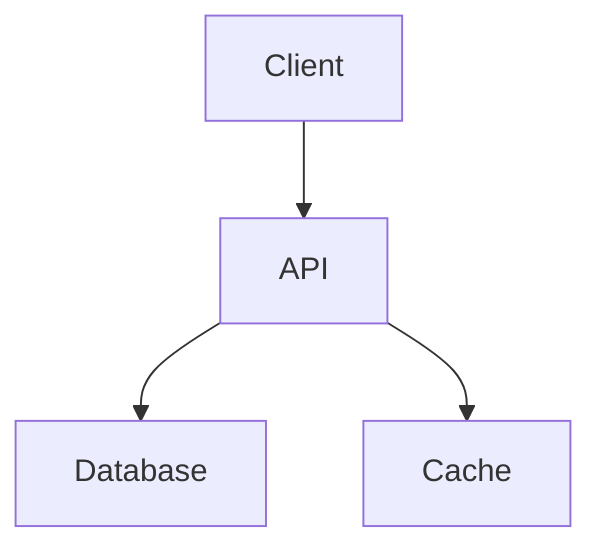

# Documentation Writer Plugin

> Professional technical documentation generator for GitHub wikis - create comprehensive feature docs, API references, architecture guides, tutorials, and how-to guides.

**Version:** 1.0.0
**Author:** Yannick De Backer (yannick@kobozo.eu)

---

## Table of Contents

- [Overview](#overview)
- [Key Features](#key-features)
- [Installation](#installation)
- [Quick Start](#quick-start)
- [Command Reference](#command-reference)
  - [/document-this](#document-this)
- [Agent Reference](#agent-reference)
  - [technical-writer](#technical-writer-agent)
- [Documentation Types](#documentation-types)
  - [Feature Documentation](#feature-documentation)
  - [API Documentation](#api-documentation)
  - [Architecture Documentation](#architecture-documentation)
  - [Tutorial Documentation](#tutorial-documentation)
  - [Guide Documentation](#guide-documentation)
- [Output Structure](#output-structure)
- [GitHub Wiki Integration](#github-wiki-integration)
- [Workflow Examples](#workflow-examples)
- [Best Practices](#best-practices)
- [Tips and Tricks](#tips-and-tricks)

---

## Overview

The Documentation Writer plugin automatically generates professional, comprehensive technical documentation for your codebase. It analyzes code, features, or concepts and produces well-structured markdown files optimized for GitHub wikis.

The plugin uses an intelligent technical writer agent that:
- Searches your codebase for relevant implementation details
- Analyzes functionality and purpose
- Generates clear, example-rich documentation
- Organizes content into appropriate subdirectories
- Follows documentation best practices

All documentation is saved to the `./docs` directory, ready to be published to your GitHub wiki.

---

## Key Features

- **Intelligent Subject Analysis**: Automatically detects whether you're documenting a file, directory, function, class, or concept
- **Multiple Documentation Types**: Feature docs, API references, architecture guides, tutorials, and how-to guides
- **Auto-Organization**: Smart directory structure (features/, api/, architecture/, guides/, tutorials/)
- **Rich Formatting**: Code examples, Mermaid diagrams, tables, and admonitions
- **GitHub Wiki Ready**: All output is optimized for GitHub wiki compatibility
- **Comprehensive Coverage**: Includes overview, usage, configuration, troubleshooting, and related links
- **Best Practices Built-in**: Follows technical writing standards for clarity and comprehension

---

## Installation

This plugin is included in the official kobozo-plugins repository. To use it with Claude Code:

1. Ensure you have Claude Code installed
2. Clone or link this plugin repository
3. The plugin will be automatically available in your Claude Code session

```bash
# If not already installed, clone the plugins repo
git clone https://github.com/yannickdekoninck/kobozo-plugins.git

# Link to your Claude Code plugins directory (if needed)
ln -s /path/to/kobozo-plugins/plugins/documentation-writer ~/.claude/plugins/
```

---

## Quick Start

Generate documentation with a single command:

```bash
# Document an authentication feature
/document-this authentication

# Document an API with specific type
/document-this "user management API" --type=api

# Document system architecture
/document-this "system architecture" --type=architecture

# Document with custom output path
/document-this database-migrations --output=./docs/guides
```

The plugin will:
1. Analyze your codebase for the subject
2. Determine the appropriate documentation type
3. Generate comprehensive markdown documentation
4. Save to the `./docs` directory with proper organization

---

## Command Reference

### /document-this

Generate comprehensive documentation for any subject and save it to the `./docs` directory.

**Syntax:**
```
/document-this <subject> [--type=TYPE] [--output=PATH]
```

**Parameters:**

| Parameter | Type | Required | Description |
|-----------|------|----------|-------------|
| `subject` | string | Yes | What to document (feature name, file path, directory, concept, class name) |
| `--type` | string | No | Documentation type: `feature`, `api`, `architecture`, `tutorial`, `guide` (auto-detected if omitted) |
| `--output` | path | No | Output directory (default: `./docs`) |

**Examples:**

```bash
# Document a feature (auto-detects type)
/document-this authentication

# Specify exact documentation type
/document-this "REST API endpoints" --type=api

# Document from a specific file
/document-this src/services/auth.service.ts

# Document entire directory as API docs
/document-this src/api/ --type=api

# Document a specific class or function
/document-this UserRepository

# Document a concept found in codebase
/document-this "rate limiting"

# Custom output directory
/document-this deployment --type=guide --output=./docs/operations
```

**Execution Flow:**

1. **Subject Analysis**
   - Launches the technical-writer agent
   - Searches codebase for relevant files
   - Reads implementation details
   - Identifies key features and functionality

2. **Documentation Type Detection**
   - Uses `--type` flag if provided
   - Otherwise, auto-detects based on subject and context
   - Chooses appropriate template and structure

3. **Content Generation**
   - Creates comprehensive documentation with:
     - Overview and introduction
     - Code examples and usage
     - Configuration options
     - Mermaid diagrams (when appropriate)
     - Tables for structured data
     - Troubleshooting section
     - Related documentation links

4. **File Organization**
   - Determines appropriate subdirectory
   - Creates directories if needed
   - Generates kebab-case filename
   - Saves markdown file
   - Updates main README.md if necessary

---

## Agent Reference

### technical-writer Agent

The core agent responsible for analyzing code and generating documentation.

**Agent Metadata:**
- **Name:** technical-writer
- **Model:** claude-sonnet-4
- **Tools:** Bash, Read, Write, Glob, Grep, TodoWrite
- **Color:** Blue

**Capabilities:**

- Analyzes code structure and implementation
- Understands multiple programming languages
- Generates clear, audience-appropriate documentation
- Creates diagrams and visual aids
- Follows technical writing best practices
- Organizes information logically
- Provides comprehensive examples

**Documentation Principles:**

1. **Audience Awareness**
   - Developers: Technical depth, code examples, API references
   - End Users: Step-by-step guides, simple language
   - Architects: High-level overviews, design decisions

2. **Logical Structure**
   - Clear hierarchical organization
   - Table of contents for navigation
   - Progressive disclosure (simple to complex)

3. **Show, Don't Tell**
   - Concrete examples for every concept
   - Request/response samples
   - Before/after comparisons

4. **Clear Language**
   - Active voice
   - Present tense
   - Concise but comprehensive
   - Avoid jargon when possible

---

## Documentation Types

The plugin supports five main documentation types, each with specific structure and content focus.

### Feature Documentation

**Purpose:** Document a specific feature or functionality of your application.

**Auto-triggered when:** Subject matches a feature name, service, or module.

**Output Location:** `./docs/features/`

**Content Includes:**
- Overview of the feature
- Installation and setup instructions
- Basic usage examples
- Configuration options
- Advanced features and use cases
- Error handling
- Security best practices
- Troubleshooting common issues
- Related documentation links

**Example:**
```bash
/document-this authentication
```

**Generates:** `./docs/features/authentication.md`

**Sample Structure:**
```markdown
# Authentication Feature

## Overview
Brief description of authentication system...

## Features
- Email/password authentication
- JWT token generation
- Token refresh mechanism
- Password reset flow

## Getting Started
### Installation
### Basic Setup

## Usage
### Login
### Logout
### Token Refresh

## Configuration
Table of configuration options...

## Error Handling
Common errors and solutions...

## Security Best Practices
## Troubleshooting
## See Also
```

---

### API Documentation

**Purpose:** Document REST APIs, GraphQL endpoints, or other API interfaces.

**Auto-triggered when:** Subject contains "API", "endpoint", or references API-related files.

**Output Location:** `./docs/api/`

**Content Includes:**
- API overview and purpose
- Authentication requirements
- Base URLs and versioning
- Complete endpoint list with HTTP methods
- Request parameters and body schemas
- Response formats and status codes
- Rate limiting information
- Error response formats
- SDK and client library examples
- Pagination and filtering

**Example:**
```bash
/document-this "user management API" --type=api
```

**Generates:** `./docs/api/user-management.md`

**Sample Structure:**
```markdown
# User Management API

## Overview
## Authentication

## Base URL
## Endpoints

### GET /users
### POST /users
### GET /users/:id
### PUT /users/:id
### DELETE /users/:id

## Request/Response Examples
## Status Codes
## Rate Limiting
## Error Responses
## SDKs and Client Libraries
```

---

### Architecture Documentation

**Purpose:** Document system design, component relationships, and technical architecture.

**Auto-triggered when:** Subject contains "architecture", "design", "system", or references architectural concepts.

**Output Location:** `./docs/architecture/`

**Content Includes:**
- System overview
- Architecture diagrams (Mermaid)
- Component descriptions
- Technology stack
- Data flow diagrams
- Database schema
- Deployment architecture
- Scalability considerations
- Security architecture
- Monitoring and observability
- Future improvements

**Example:**
```bash
/document-this "system architecture" --type=architecture
```

**Generates:** `./docs/architecture/overview.md`

**Sample Structure:**
```markdown
# System Architecture

## Overview
## Architecture Diagram
(Mermaid diagram showing components)

## Components
### Web Client
### API Servers
### Database
### Cache Layer
### Message Queue

## Data Flow
### User Login Flow
### Read Operation Flow
### Write Operation Flow

## Deployment
## Monitoring
## Security
## Scalability
## Future Improvements
```

---

### Tutorial Documentation

**Purpose:** Step-by-step guides for getting started or learning the system.

**Auto-triggered when:** Subject contains "getting started", "tutorial", "introduction", or similar.

**Output Location:** `./docs/tutorials/`

**Content Includes:**
- Prerequisites and requirements
- Installation steps
- Configuration walkthrough
- First project setup
- Hello World or basic example
- Explanation of key concepts
- Next steps and further learning
- Common beginner issues

**Example:**
```bash
/document-this "getting started" --type=tutorial
```

**Generates:** `./docs/tutorials/getting-started.md`

**Sample Structure:**
```markdown
# Getting Started

## Prerequisites
## Installation
### Step 1: Install Dependencies
### Step 2: Clone Repository
### Step 3: Configure Environment

## Configuration
## Your First Project
## Hello World Example
## Understanding the Basics
## Next Steps
## Common Issues
```

---

### Guide Documentation

**Purpose:** How-to guides for specific tasks or workflows.

**Auto-triggered when:** Subject describes a specific task or process.

**Output Location:** `./docs/guides/`

**Content Includes:**
- When to use this guide
- Step-by-step instructions
- Code examples for each step
- Configuration examples
- Best practices
- Common patterns
- Troubleshooting specific issues
- Related guides

**Example:**
```bash
/document-this "database migrations"
```

**Generates:** `./docs/guides/database-migrations.md`

**Sample Structure:**
```markdown
# Database Migrations

## When to Use Migrations
## Creating a Migration
## Running Migrations
## Rolling Back Changes
## Best Practices
## Common Patterns
## Troubleshooting
## See Also
```

---

## Output Structure

All documentation is organized in the `./docs` directory with a logical hierarchy:

```
./docs/
├── README.md                      # Main wiki home page
├── getting-started.md             # Quick start guide
│
├── features/                      # Feature documentation
│   ├── authentication.md
│   ├── user-management.md
│   ├── notifications.md
│   └── search.md
│
├── api/                          # API documentation
│   ├── rest-api.md
│   ├── graphql-api.md
│   ├── webhooks.md
│   └── websockets.md
│
├── architecture/                 # Architecture documentation
│   ├── overview.md
│   ├── data-flow.md
│   ├── deployment.md
│   ├── security.md
│   └── database-schema.md
│
├── guides/                       # How-to guides
│   ├── installation.md
│   ├── configuration.md
│   ├── database-migrations.md
│   ├── deployment.md
│   └── backup-restore.md
│
├── tutorials/                    # Step-by-step tutorials
│   ├── first-app.md
│   ├── authentication-setup.md
│   ├── testing.md
│   └── production-deployment.md
│
├── images/                       # Screenshots and diagrams
│   └── architecture-diagram.png
│
└── troubleshooting.md            # Common issues and solutions
```

**File Naming Conventions:**
- Lowercase with hyphens (kebab-case): `user-management.md`
- Descriptive and concise
- Matches subject where possible

**Directory Organization:**
- Automatically created as needed
- Based on documentation type
- Mirrors logical information architecture

---

## GitHub Wiki Integration

The plugin generates documentation that's ready to publish to GitHub wikis. Here are three methods to sync your `./docs` folder to your wiki:

### Method 1: Direct Clone and Copy

The simplest approach for one-time or manual syncing:

```bash
# Clone your repository's wiki
git clone https://github.com/username/repository.wiki.git

# Copy all documentation
cp -r ./docs/* ./repository.wiki/

# Commit and push to wiki
cd repository.wiki
git add .
git commit -m "Add documentation from documentation-writer plugin"
git push origin master
```

### Method 2: Wiki Submodule

Use Git submodules to keep your wiki in sync with your main repository:

```bash
# Add wiki as a submodule in your project
git submodule add https://github.com/username/repository.wiki.git wiki

# Sync docs to wiki directory
cp -r ./docs/* ./wiki/

# Commit to wiki
cd wiki
git add .
git commit -m "Update documentation"
git push origin master

# Commit submodule reference to main repo
cd ..
git add wiki
git commit -m "Update wiki submodule"
git push
```

### Method 3: Automated GitHub Actions

Set up automatic syncing whenever documentation changes:

Create `.github/workflows/sync-wiki.yml`:

```yaml
name: Sync Documentation to Wiki

on:
  push:
    branches:
      - main
    paths:
      - 'docs/**'

jobs:
  sync-wiki:
    runs-on: ubuntu-latest
    steps:
      - name: Checkout repository
        uses: actions/checkout@v3

      - name: Sync to Wiki
        env:
          GITHUB_TOKEN: ${{ secrets.GITHUB_TOKEN }}
        run: |
          # Clone wiki repository
          git clone https://github.com/${{ github.repository }}.wiki.git wiki-repo

          # Copy documentation
          cp -r docs/* wiki-repo/

          # Commit and push changes
          cd wiki-repo
          git config user.name "GitHub Actions Bot"
          git config user.email "actions@github.com"
          git add .
          git diff-index --quiet HEAD || git commit -m "Auto-sync docs from main repo"
          git push https://${{ secrets.GITHUB_TOKEN }}@github.com/${{ github.repository }}.wiki.git
```

This automatically syncs any changes in the `docs/` directory to your wiki.

---

## Workflow Examples

### Example 1: Document a New Authentication Feature

**Scenario:** You've built an authentication system and want to document it.

```bash
/document-this authentication
```

**What Happens:**
1. Agent searches codebase for auth-related files
2. Analyzes login, logout, token management
3. Generates `./docs/features/authentication.md` with:
   - Feature overview
   - Setup instructions
   - Login/logout examples
   - Configuration options (JWT secret, token expiry)
   - Security best practices
   - Troubleshooting section

**Output Preview:**
```markdown
# Authentication Feature

## Overview
The authentication system provides secure user login using JWT tokens...

## Getting Started
### Installation
### Basic Setup

## Usage
### Login
const { token, user } = await auth.login({...})

### Logout
### Token Refresh

## Configuration
| Option | Type | Default | Description |
...
```

---

### Example 2: Document REST API Endpoints

**Scenario:** You want to document all user management API endpoints.

```bash
/document-this "user management API" --type=api
```

**What Happens:**
1. Agent finds API route definitions
2. Analyzes request/response structures
3. Generates `./docs/api/user-management.md` with:
   - Authentication requirements
   - Base URL
   - All endpoints (GET, POST, PUT, DELETE)
   - Request parameters and body schemas
   - Response examples with status codes
   - Rate limiting info
   - Error responses

**Output Preview:**
```markdown
# User Management API

## Authentication
All endpoints require JWT token...

## Endpoints

### GET /api/users
List all users

**Parameters:**
- page (number, optional)
- limit (number, optional)

**Response (200):**
{
  "users": [...],
  "total": 100,
  "page": 1
}
...
```

---

### Example 3: Document System Architecture

**Scenario:** You need to create architecture documentation for new team members.

```bash
/document-this "system architecture" --type=architecture
```

**What Happens:**
1. Agent analyzes your tech stack
2. Identifies components (frontend, backend, database, cache)
3. Generates `./docs/architecture/overview.md` with:
   - Mermaid architecture diagram
   - Component descriptions
   - Data flow diagrams
   - Technology stack
   - Deployment setup
   - Scalability notes

**Output Preview:**
```markdown
# System Architecture

## Architecture Diagram


## Components
### Web Client
Technology: React + TypeScript...

### API Server
Technology: Node.js + Express...

## Data Flow
### User Login Flow
1. Client sends credentials...
...
```

---

### Example 4: Create a Getting Started Tutorial

**Scenario:** You want to help new users get up and running quickly.

```bash
/document-this "getting started" --type=tutorial
```

**What Happens:**
1. Agent identifies installation process
2. Finds configuration files
3. Generates `./docs/tutorials/getting-started.md` with:
   - Prerequisites
   - Step-by-step installation
   - Configuration walkthrough
   - Hello World example
   - Next steps

---

### Example 5: Document a Specific Task

**Scenario:** You want to document how to perform database migrations.

```bash
/document-this "database migrations" --type=guide
```

**What Happens:**
1. Agent finds migration scripts and tools
2. Analyzes migration workflow
3. Generates `./docs/guides/database-migrations.md` with:
   - When to use migrations
   - Creating a migration
   - Running migrations
   - Rolling back
   - Best practices

---

## Best Practices

### 1. Be Specific with Subjects

**Good:**
```bash
/document-this "JWT authentication system"
/document-this src/services/email.service.ts
/document-this "WebSocket real-time notifications"
```

**Avoid:**
```bash
/document-this "stuff"
/document-this "code"
```

### 2. Use Type Flags for Clarity

While auto-detection works well, explicitly specifying the type ensures you get the desired format:

```bash
/document-this caching --type=architecture  # Architecture doc
/document-this caching --type=guide         # How-to guide
```

### 3. Organize Related Documentation

Group related topics together:

```bash
# Create a series of guides
/document-this "local development setup" --type=guide
/document-this "production deployment" --type=guide
/document-this "CI/CD pipeline" --type=guide
```

### 4. Update Documentation Regularly

Re-run commands when features change:

```bash
# After updating authentication
/document-this authentication
# The agent will regenerate with latest code
```

### 5. Review Generated Documentation

Always review the generated docs to:
- Verify accuracy
- Add project-specific context
- Include screenshots or diagrams
- Update examples with real data

### 6. Link Related Documents

After generating multiple docs, cross-link them:

```markdown
## See Also
- [Authentication](./authentication.md)
- [User Management API](../api/user-management.md)
- [Security Best Practices](../guides/security.md)
```

### 7. Use Consistent Naming

Keep subject names consistent with your actual feature names:

```bash
# If your code uses "auth", use that
/document-this auth

# Not "authentication" if code doesn't use that term
```

### 8. Start with High-Level Docs

Create architecture and overview docs first:

```bash
# Start broad
/document-this "system architecture" --type=architecture
/document-this "getting started" --type=tutorial

# Then get specific
/document-this authentication --type=feature
/document-this "users API" --type=api
```

---

## Tips and Tricks

### Auto-detect File Type

Point directly to a file and let the agent figure out what to document:

```bash
/document-this src/api/controllers/UserController.ts
# Auto-generates API documentation
```

### Document Entire Directories

Document all features in a directory:

```bash
/document-this src/features/notifications/
# Generates comprehensive notification feature doc
```

### Update Main README Automatically

The agent can update your main `./docs/README.md` with links to new documentation:

```bash
/document-this authentication
# Agent adds link to ./docs/README.md automatically
```

### Generate Diagrams

Ask for architecture or flow diagrams:

```bash
/document-this "authentication flow" --type=architecture
# Includes Mermaid sequence diagrams
```

### Combine with Other Plugins

Use with the API documenter for comprehensive API coverage:

```bash
# First, generate API reference
/api-document

# Then, create API usage guide
/document-this "API usage guide" --type=guide
```

### Create Documentation TODOs

Use the TodoWrite tool to track documentation tasks:

```bash
# Agent can create TODOs for incomplete documentation
# These appear in your TODO.md file
```

### Search Before Documenting

Let the agent search your entire codebase:

```bash
/document-this "rate limiting strategy"
# Agent searches all files for rate limiting code
# Generates comprehensive guide from findings
```

---

## Troubleshooting

### Issue: Documentation is Too Generic

**Solution:** Be more specific with your subject and provide file paths:

```bash
# Instead of:
/document-this "api"

# Use:
/document-this src/api/v2/users.ts --type=api
```

### Issue: Wrong Documentation Type Generated

**Solution:** Explicitly specify the `--type` flag:

```bash
/document-this caching --type=architecture
```

### Issue: Missing Code Examples

**Solution:** Ensure the agent can find your implementation files. Check that:
- Files are not gitignored
- Paths are correct
- Code is well-commented

### Issue: Documentation Not Saved to Expected Location

**Solution:** Use the `--output` flag to specify exact path:

```bash
/document-this deployment --type=guide --output=./docs/operations
```

---

## Contributing

Found a bug or have a suggestion? Please open an issue or submit a pull request to the [kobozo-plugins repository](https://github.com/yannickdekoninck/kobozo-plugins).

---

## License

This plugin is part of the kobozo-plugins collection. See the main repository for license information.

---

## Support

For questions, issues, or feature requests:

- **Email:** yannick@kobozo.eu
- **GitHub Issues:** [kobozo-plugins/issues](https://github.com/yannickdekoninck/kobozo-plugins/issues)

---

**Happy Documenting!** Create clear, comprehensive documentation that helps your users understand and love your project.
